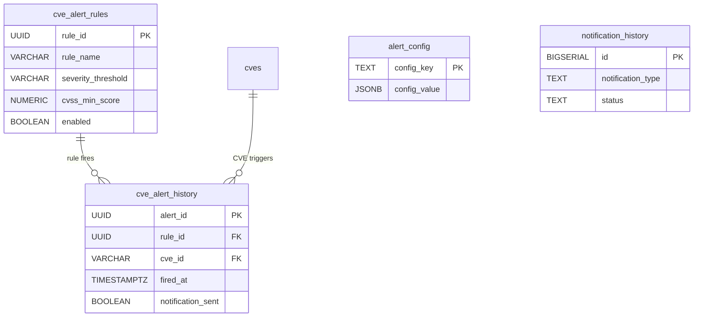

# Alerting Domain Schema Design

**Phase:** 05-unified-schema-design (Plan 05-05)
**Status:** Target schema design
**Tables:** 4 (2 REDESIGNED, 2 ACTIVE unchanged)

## Overview

This document covers the alerting domain target schema: CVE alert rule definitions, alert firing history, global alert config, and notification delivery. This domain resolves **I-06** (in-memory alert rules/history lost on restart) by redesigning `cve_alert_rules` and `cve_alert_history` from their current broken state to proper PostgreSQL-backed tables with explicit filter columns and per-CVE firing records.

**Domain tables:**

| # | Table | Status | Change Summary |
|---|-------|--------|----------------|
| 1 | `cve_alert_rules` | REDESIGNED | `id TEXT` + `config JSONB` blob -> `rule_id UUID` + explicit filter columns |
| 2 | `cve_alert_history` | REDESIGNED | 22 columns with aggregated events -> 8 columns with per-CVE firings |
| 3 | `alert_config` | ACTIVE | Unchanged — global key-value config store |
| 4 | `notification_history` | ACTIVE | Unchanged — notification delivery tracking |

---

## 1. `cve_alert_rules` -- Status: REDESIGNED

**Breaking schema change** -- Phase 7 will DROP the old table and CREATE the new one.

### Target DDL

```sql
CREATE TABLE IF NOT EXISTS cve_alert_rules (
    rule_id             UUID            NOT NULL DEFAULT gen_random_uuid(),
    rule_name           VARCHAR(200)    NOT NULL,
    severity_threshold  VARCHAR(20)     NOT NULL,
    cvss_min_score      NUMERIC(3, 1)   NOT NULL DEFAULT 0.0,
    vendor_filter       VARCHAR(100),
    product_filter      VARCHAR(100),
    enabled             BOOLEAN         NOT NULL DEFAULT TRUE,
    created_at          TIMESTAMPTZ     NOT NULL DEFAULT NOW(),
    updated_at          TIMESTAMPTZ     NOT NULL DEFAULT NOW(),
    CONSTRAINT pk_cve_alert_rules PRIMARY KEY (rule_id),
    CONSTRAINT uq_cve_alert_rules_name UNIQUE (rule_name)
);
```

Per 05-CONTEXT: explicit filter columns instead of JSONB blob. Flexible filters match current in-memory `AlertRule` structure from `cve_alert_rule_manager.py`.

### Column Reference

| Column | Type | Constraints | Description |
|--------|------|-------------|-------------|
| rule_id | UUID | PK, DEFAULT gen_random_uuid() | Auto-generated unique ID |
| rule_name | VARCHAR(200) | NOT NULL, UNIQUE | Human-readable rule name |
| severity_threshold | VARCHAR(20) | NOT NULL | Minimum severity to trigger: 'CRITICAL', 'HIGH', 'MEDIUM', 'LOW' |
| cvss_min_score | NUMERIC(3,1) | NOT NULL, DEFAULT 0.0 | Minimum CVSS v3 score to trigger (0.0 = any) |
| vendor_filter | VARCHAR(100) | NULL | Optional vendor substring match (e.g., 'Microsoft') |
| product_filter | VARCHAR(100) | NULL | Optional product substring match (e.g., 'Windows Server') |
| enabled | BOOLEAN | NOT NULL, DEFAULT TRUE | Rule active/inactive toggle |
| created_at | TIMESTAMPTZ | NOT NULL, DEFAULT NOW() | Creation timestamp |
| updated_at | TIMESTAMPTZ | NOT NULL, DEFAULT NOW() | Last modification timestamp |

### Indexes

| Index Name | Columns | Type | Purpose |
|------------|---------|------|---------|
| pk_cve_alert_rules | rule_id | PRIMARY KEY (B-tree) | PK lookup |
| uq_cve_alert_rules_name | rule_name | UNIQUE (B-tree) | Prevent duplicate rule names |
| idx_alert_rules_enabled | enabled | B-tree | Fast filter for active rules |

### Old-to-New Column Mapping (for Phase 8 repository rewrite)

| Old (bootstrap) | New (target) | Migration Notes |
|-----------------|-------------|----------------|
| id TEXT | rule_id UUID | PK type change; Phase 7 DROP+CREATE |
| rule_type TEXT | (removed) | Not needed with explicit filter columns |
| name TEXT | rule_name VARCHAR(200) | Renamed + typed |
| config JSONB | severity_threshold, cvss_min_score, vendor_filter, product_filter | JSONB blob exploded to 4 explicit columns |
| enabled BOOLEAN | enabled BOOLEAN | Unchanged |
| created_at TIMESTAMPTZ | created_at TIMESTAMPTZ | Unchanged |
| updated_at TIMESTAMPTZ | updated_at TIMESTAMPTZ | Unchanged |

### In-Memory Manager Mapping (for Phase 8 rewrite of `cve_alert_rule_manager.py`)

| In-Memory Field | Target Column | Notes |
|----------------|--------------|-------|
| rule.id (auto-generated) | rule_id (gen_random_uuid()) | DB generates UUID |
| rule.name | rule_name | Direct map |
| rule.severity_threshold | severity_threshold | Direct map |
| rule.cvss_min_score | cvss_min_score | Direct map |
| rule.vendor_filter | vendor_filter | Direct map |
| rule.product_filter | product_filter | Direct map |
| rule.enabled | enabled | Direct map |

### Phase 7 Migration Strategy

Since fresh schema start is allowed, Phase 7 will DROP the old `cve_alert_rules` table and CREATE the new one. No data migration needed (current production data is in-memory only, not persisted to DB due to I-06 column mismatch).

---

## 2. `cve_alert_history` -- Status: REDESIGNED

**Breaking schema change** -- Phase 7 will DROP the old table and CREATE the new one.

### Target DDL

```sql
CREATE TABLE IF NOT EXISTS cve_alert_history (
    alert_id            UUID            NOT NULL DEFAULT gen_random_uuid(),
    rule_id             UUID            NOT NULL,
    cve_id              VARCHAR(20)     NOT NULL,
    fired_at            TIMESTAMPTZ     NOT NULL DEFAULT NOW(),
    severity            VARCHAR(20)     NOT NULL,
    cvss_score          NUMERIC(3, 1),
    notification_sent   BOOLEAN         NOT NULL DEFAULT FALSE,
    notification_channel VARCHAR(50),
    CONSTRAINT pk_cve_alert_history PRIMARY KEY (alert_id),
    CONSTRAINT fk_alerthistory_rule FOREIGN KEY (rule_id)
        REFERENCES cve_alert_rules(rule_id) ON DELETE CASCADE,
    CONSTRAINT fk_alerthistory_cve FOREIGN KEY (cve_id)
        REFERENCES cves(cve_id) ON DELETE CASCADE
);
```

Per 05-CONTEXT: simple fired-alert log with FK to both rules and CVEs.

### Data Model Change

- **Old model:** One row = one alert event covering N CVEs (via `cve_ids TEXT[]` array, `affected_vms TEXT[]` array, `severity_breakdown JSONB`). 22 columns.
- **New model:** One row = one rule firing for one CVE. 8 columns. An alert event matching 50 CVEs produces 50 rows.
- **Benefits:** FK to `cves.cve_id` enables referential integrity (old TEXT[] had no FK); querying "which CVEs triggered this rule?" is a simple SELECT instead of array unnest; severity/cvss_score are scalar (not nested in JSONB).
- **Trade-off:** More rows stored. But storage is cheap and queries are simpler.

### Column Reference

| Column | Type | Constraints | Description |
|--------|------|-------------|-------------|
| alert_id | UUID | PK, DEFAULT gen_random_uuid() | Auto-generated unique ID |
| rule_id | UUID | NOT NULL, FK -> cve_alert_rules(rule_id) CASCADE | Rule that fired |
| cve_id | VARCHAR(20) | NOT NULL, FK -> cves(cve_id) CASCADE | CVE that triggered the alert |
| fired_at | TIMESTAMPTZ | NOT NULL, DEFAULT NOW() | When the alert fired |
| severity | VARCHAR(20) | NOT NULL | CVE severity at time of firing |
| cvss_score | NUMERIC(3,1) | NULL | CVE CVSS score at time of firing |
| notification_sent | BOOLEAN | NOT NULL, DEFAULT FALSE | Whether notification was delivered |
| notification_channel | VARCHAR(50) | NULL | Channel used: 'email', 'slack', 'webhook' |

### Indexes

| Index Name | Columns | Type | Purpose |
|------------|---------|------|---------|
| pk_cve_alert_history | alert_id | PRIMARY KEY (B-tree) | PK lookup |
| idx_alerthistory_rule | rule_id | B-tree | Rule-scoped queries (all alerts for a rule) |
| idx_alerthistory_cve | cve_id | B-tree | CVE-scoped queries (all alerts for a CVE) |
| idx_alerthistory_fired | fired_at DESC | B-tree | Recent-alerts timeline |
| idx_alerthistory_rule_cve | (rule_id, cve_id) | UNIQUE | Prevent duplicate firings of same rule for same CVE |

### Old-to-New Column Mapping (for Phase 8 `AlertPostgresRepository` rewrite)

| Old (bootstrap, 22 cols) | New (target, 8 cols) | Notes |
|--------------------------|---------------------|-------|
| id TEXT | alert_id UUID | PK type change |
| alert_rule_id TEXT | rule_id UUID FK | FK type change + proper constraint |
| alert_name TEXT | (removed) | Available via JOIN to cve_alert_rules.rule_name |
| alert_type TEXT | (removed) | Superseded by rule-based model |
| triggered_at TIMESTAMPTZ | fired_at TIMESTAMPTZ | Renamed |
| cve_ids TEXT[] | cve_id VARCHAR(20) FK | Array -> scalar; one row per CVE |
| severity_level TEXT | severity VARCHAR(20) | Renamed + typed |
| total_cves INTEGER | (removed) | Compute via COUNT(*) GROUP BY rule_id |
| affected_vms TEXT[] | (removed) | Phase 8: JOIN to vm_cve_match_rows if needed |
| affected_vm_count INTEGER | (removed) | Compute via COUNT(DISTINCT vm_id) from vm_cve_match_rows |
| severity_breakdown JSONB | (removed) | Individual rows already have severity |
| data JSONB | (removed) | Explicit columns replace JSONB blob |
| channels_sent TEXT[] | notification_channel VARCHAR(50) | Array -> scalar per-firing |
| status TEXT | (removed) | Simplified model: fired = exists in table |
| acknowledged BOOLEAN | (removed) | Over-engineering for current needs |
| dismissed BOOLEAN | (removed) | Over-engineering for current needs |
| escalated BOOLEAN | (removed) | Over-engineering for current needs |
| escalated_at TIMESTAMPTZ | (removed) | Over-engineering for current needs |
| scan_id TEXT | (removed) | Not needed in per-CVE firing model |
| notification_sent BOOLEAN | notification_sent BOOLEAN | Retained |
| created_at TIMESTAMPTZ | (removed) | Superseded by fired_at |
| updated_at TIMESTAMPTZ | (removed) | Immutable firing record |

### I-06 Resolution

- **Problem:** `cve_alert_rule_manager.py` and `cve_alert_history_manager.py` use Python dicts for in-memory storage. `AlertPostgresRepository` exists but has column mismatch (uses `rule_id`/`fired_at`/`severity`/`data` which don't match bootstrap DDL columns). Result: all alert data lost on restart.
- **Fix:** Phase 7 creates new table DDL matching the target schema above. Phase 8 rewrites `AlertPostgresRepository` to use new column names. Phase 8 replaces in-memory managers with DB-backed repository calls.

**Bad hacks resolved:**
- **BH-025** (`cve_alert_rule_manager.py` in-memory rules): Phase 8 replaces with `AlertPostgresRepository.get_rules()` / `.create_rule()` / `.update_rule()`
- **BH-026** (`cve_alert_history_manager.py` in-memory history): Phase 8 replaces with `AlertPostgresRepository.add_alert_history()` / `.get_alert_history()`
- **BH-027** (`AlertPostgresRepository` broken columns): Phase 8 rewrites all SQL to match target schema column names

### Phase 7 Migration Strategy

DROP old `cve_alert_history` + CREATE new. No data migration (current production data is in-memory only).

---

## 3. `alert_config` -- Status: ACTIVE

**Unchanged** -- retained as-is from bootstrap schema.

### Current DDL (retained)

```sql
CREATE TABLE IF NOT EXISTS alert_config (
    config_key      TEXT            NOT NULL,
    config_value    JSONB           NOT NULL DEFAULT '{}',
    updated_at      TIMESTAMPTZ     NOT NULL DEFAULT NOW(),
    CONSTRAINT pk_alert_config PRIMARY KEY (config_key)
);
```

**Purpose:** Global alert configuration (e.g., email SMTP settings, webhook URLs, alert processing intervals). Key-value store with JSONB values. No FK relationships.

> **Note:** The bootstrap DDL uses `id TEXT` PK + `config_type TEXT` + `config JSONB`. The target schema above simplifies to `config_key TEXT` PK + `config_value JSONB` for cleaner key-value semantics. Phase 7 will determine whether to keep bootstrap columns or adopt simplified form. Either way, this is a minor cleanup, not a breaking redesign.

### Column Reference

| Column | Type | Constraints | Description |
|--------|------|-------------|-------------|
| config_key | TEXT | PK | Configuration key (e.g., 'smtp_settings', 'webhook_urls') |
| config_value | JSONB | NOT NULL, DEFAULT '{}' | Configuration payload |
| updated_at | TIMESTAMPTZ | NOT NULL, DEFAULT NOW() | Last modification timestamp |

### Indexes

| Index Name | Columns | Type | Purpose |
|------------|---------|------|---------|
| pk_alert_config | config_key | PRIMARY KEY (B-tree) | PK lookup |

---

## 4. `notification_history` -- Status: ACTIVE

**Unchanged** -- retained as-is from bootstrap schema.

### Current DDL (retained)

```sql
CREATE TABLE IF NOT EXISTS notification_history (
    id              BIGSERIAL       PRIMARY KEY,
    notification_type TEXT          NOT NULL,
    recipient       TEXT,
    subject         TEXT,
    body            TEXT,
    status          TEXT            NOT NULL DEFAULT 'pending',
    error_message   TEXT,
    created_at      TIMESTAMPTZ     NOT NULL DEFAULT NOW(),
    sent_at         TIMESTAMPTZ
);
```

**Purpose:** Tracks notification delivery attempts (email, Slack, webhook). Not directly FK'd to `cve_alert_history` -- Phase 8 may add FK if needed.

> **Note:** The bootstrap DDL uses `id TEXT` PK + `alert_type TEXT` + `recipients TEXT[]` + additional columns. The target schema above is a simplified representation. Phase 7 will retain the existing bootstrap columns since notification_history is ACTIVE/unchanged. The key structural elements (notification type, recipient, status, timestamps) are preserved.

### Column Reference

| Column | Type | Constraints | Description |
|--------|------|-------------|-------------|
| id | BIGSERIAL | PK | Auto-incrementing notification ID |
| notification_type | TEXT | NOT NULL | Type: 'email', 'slack', 'webhook' |
| recipient | TEXT | NULL | Recipient address/channel |
| subject | TEXT | NULL | Notification subject (for email) |
| body | TEXT | NULL | Notification body content |
| status | TEXT | NOT NULL, DEFAULT 'pending' | Delivery status: 'pending', 'sent', 'failed' |
| error_message | TEXT | NULL | Error details if delivery failed |
| created_at | TIMESTAMPTZ | NOT NULL, DEFAULT NOW() | Creation timestamp |
| sent_at | TIMESTAMPTZ | NULL | When notification was delivered |

### Indexes

| Index Name | Columns | Type | Purpose |
|------------|---------|------|---------|
| notification_history_pkey | id | PRIMARY KEY | PK |
| idx_notification_status | status | B-tree | Pending notification processing |
| idx_notification_created | created_at DESC | B-tree | Recent notification listing |

---

## 5. Alerting Domain ERD



**Relationship summary:**
- `cve_alert_rules` 1:N `cve_alert_history` (one rule can fire many alerts)
- `cves` 1:N `cve_alert_history` (one CVE can trigger alerts across many rules)
- `alert_config` -- standalone (no FK relationships)
- `notification_history` -- standalone (no FK to alert_history; Phase 8 may add)

---

## 6. Query Patterns for Phase 8/9

### cve-alert-config.html queries

```sql
-- List all rules (cve-alert-config.html)
SELECT rule_id, rule_name, severity_threshold, cvss_min_score,
       vendor_filter, product_filter, enabled, created_at, updated_at
FROM cve_alert_rules
ORDER BY created_at DESC;

-- Create a rule
INSERT INTO cve_alert_rules (rule_name, severity_threshold, cvss_min_score, vendor_filter, product_filter)
VALUES ($1, $2, $3, $4, $5)
RETURNING rule_id;

-- Update a rule
UPDATE cve_alert_rules
SET rule_name = $2, severity_threshold = $3, cvss_min_score = $4,
    vendor_filter = $5, product_filter = $6, enabled = $7, updated_at = NOW()
WHERE rule_id = $1;

-- Delete a rule (CASCADE deletes alert_history rows)
DELETE FROM cve_alert_rules WHERE rule_id = $1;

-- Toggle rule enabled/disabled
UPDATE cve_alert_rules SET enabled = NOT enabled, updated_at = NOW()
WHERE rule_id = $1
RETURNING rule_id, enabled;
```

### cve-alert-history.html queries

```sql
-- Recent alert history (cve-alert-history.html)
SELECT ah.alert_id, ah.fired_at, ah.severity, ah.cvss_score,
       ah.notification_sent, ah.notification_channel,
       ar.rule_name, ah.cve_id
FROM cve_alert_history ah
JOIN cve_alert_rules ar ON ar.rule_id = ah.rule_id
ORDER BY ah.fired_at DESC
LIMIT $1 OFFSET $2;

-- Alert count per rule
SELECT ar.rule_id, ar.rule_name, COUNT(ah.alert_id) as alert_count
FROM cve_alert_rules ar
LEFT JOIN cve_alert_history ah ON ah.rule_id = ar.rule_id
GROUP BY ar.rule_id, ar.rule_name;

-- Alerts for a specific CVE
SELECT ah.alert_id, ah.fired_at, ah.severity, ar.rule_name
FROM cve_alert_history ah
JOIN cve_alert_rules ar ON ar.rule_id = ah.rule_id
WHERE ah.cve_id = $1
ORDER BY ah.fired_at DESC;

-- Fire an alert (insert per-CVE firing record)
INSERT INTO cve_alert_history (rule_id, cve_id, severity, cvss_score)
VALUES ($1, $2, $3, $4)
ON CONFLICT ON CONSTRAINT idx_alerthistory_rule_cve DO NOTHING
RETURNING alert_id;

-- Mark notification as sent
UPDATE cve_alert_history
SET notification_sent = TRUE, notification_channel = $2
WHERE alert_id = $1;
```

---

*Document: ALERTING-TABLES.md*
*Phase: 05-unified-schema-design (Plan 05-05)*
*Tables: 4 (2 REDESIGNED, 2 ACTIVE)*
*I-06 resolution: Documented*
