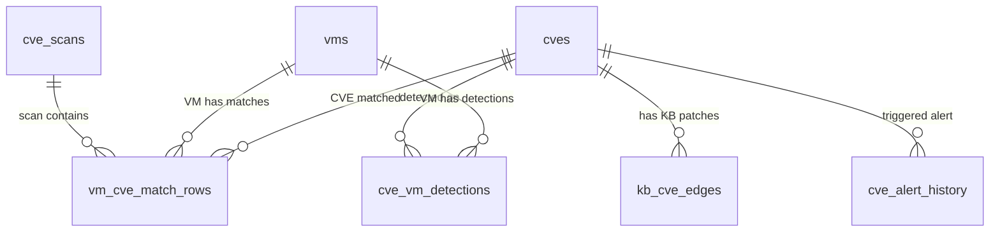

# CVE Domain Schema Design

**Phase:** 05-unified-schema-design
**Plan:** 05-02 CVE Data Tables Design
**Status:** Complete
**Generated:** 2026-03-17
**Requirements addressed:** DB-01, DB-02, DB-03

This document specifies the target DDL for all CVE-domain tables: `cves`, `kb_cve_edges`, `vm_cve_match_rows`, `cve_vm_detections`, and `cve_scans`. It resolves Known Issue I-09 (column mismatch between bootstrap and migration 011 `cves` schemas) and confirms I-01 resolution (`kb_cve_edges` plural is canonical; `kb_cve_edge` singular is DROP target).

---

## 1. `cves` Table

**Status: ACTIVE** (no structural changes to bootstrap DDL)

The bootstrap DDL from `pg_database.py` is runtime-authoritative. The 21-column set (20 bootstrap + `search_vector` from migration 006) is the canonical schema. Migration 011's `CREATE TABLE IF NOT EXISTS cves` is a silent no-op because bootstrap creates the table first.

### DDL

```sql
CREATE TABLE IF NOT EXISTS cves (
    cve_id              TEXT            PRIMARY KEY,
    description         TEXT,
    published_at        TIMESTAMPTZ,
    modified_at         TIMESTAMPTZ,
    cvss_v2_score       NUMERIC(4, 2),
    cvss_v2_severity    TEXT,
    cvss_v2_vector      TEXT,
    cvss_v2_exploitability NUMERIC(6, 3),
    cvss_v2_impact      NUMERIC(6, 3),
    cvss_v3_score       NUMERIC(4, 2),
    cvss_v3_severity    TEXT,
    cvss_v3_vector      TEXT,
    cvss_v3_exploitability NUMERIC(6, 3),
    cvss_v3_impact      NUMERIC(6, 3),
    cwe_ids             TEXT[],
    affected_products   JSONB,
    "references"        JSONB,
    vendor_metadata     JSONB,
    sources             TEXT[],
    synced_at           TIMESTAMPTZ     NOT NULL DEFAULT NOW(),
    search_vector       tsvector
);
```

### Columns

| # | Column | Type | Nullable | Default | Description |
|---|--------|------|----------|---------|-------------|
| 1 | `cve_id` | TEXT | NOT NULL | -- | Primary key. CVE identifier (e.g., `CVE-2024-12345`) |
| 2 | `description` | TEXT | NULL | -- | Human-readable vulnerability description |
| 3 | `published_at` | TIMESTAMPTZ | NULL | -- | NVD publication date. Used by trending MVs and age bucketing |
| 4 | `modified_at` | TIMESTAMPTZ | NULL | -- | Last NVD modification date |
| 5 | `cvss_v2_score` | NUMERIC(4,2) | NULL | -- | CVSS v2 base score (0.00-10.00) |
| 6 | `cvss_v2_severity` | TEXT | NULL | -- | CVSS v2 severity string |
| 7 | `cvss_v2_vector` | TEXT | NULL | -- | CVSS v2 vector string |
| 8 | `cvss_v2_exploitability` | NUMERIC(6,3) | NULL | -- | CVSS v2 exploitability subscore |
| 9 | `cvss_v2_impact` | NUMERIC(6,3) | NULL | -- | CVSS v2 impact subscore |
| 10 | `cvss_v3_score` | NUMERIC(4,2) | NULL | -- | CVSS v3 base score (0.0-10.0). Primary score used in dashboards |
| 11 | `cvss_v3_severity` | TEXT | NULL | -- | CVSS v3 severity: CRITICAL/HIGH/MEDIUM/LOW/UNKNOWN. Used by severity filters and MV bucketing |
| 12 | `cvss_v3_vector` | TEXT | NULL | -- | CVSS v3 vector string |
| 13 | `cvss_v3_exploitability` | NUMERIC(6,3) | NULL | -- | CVSS v3 exploitability subscore |
| 14 | `cvss_v3_impact` | NUMERIC(6,3) | NULL | -- | CVSS v3 impact subscore |
| 15 | `cwe_ids` | TEXT[] | NULL | -- | Array of CWE identifiers (e.g., `{CWE-79, CWE-89}`) |
| 16 | `affected_products` | JSONB | NULL | -- | Array of product objects; used by `mv_inventory_os_cve_counts` |
| 17 | `"references"` | JSONB | NULL | -- | External reference links (quoted identifier -- `references` is a reserved word) |
| 18 | `vendor_metadata` | JSONB | NULL | -- | Vendor-specific data from NVD/CVE.org feeds |
| 19 | `sources` | TEXT[] | NULL | -- | Source tags array, e.g., `{nvd, cve_org, msrc}` |
| 20 | `synced_at` | TIMESTAMPTZ | NOT NULL | `NOW()` | Last sync timestamp from NVD/vendor feed |
| 21 | `search_vector` | tsvector | NULL | -- | Auto-populated by trigger from `description` + `cve_id`. Supports full-text search |

### Search Vector Trigger

```sql
CREATE OR REPLACE FUNCTION trg_cves_search_vector_update_fn()
RETURNS TRIGGER AS $$
BEGIN
    NEW.search_vector := to_tsvector('english', COALESCE(NEW.description, '') || ' ' || NEW.cve_id);
    RETURN NEW;
END;
$$ LANGUAGE plpgsql;

CREATE TRIGGER trg_cves_search_vector_update
    BEFORE INSERT OR UPDATE ON cves
    FOR EACH ROW
    EXECUTE FUNCTION trg_cves_search_vector_update_fn();
```

### Indexes (Retained As-Is)

| Index Name | Columns | Type | Purpose |
|------------|---------|------|---------|
| `cves_pkey` | `cve_id` | PRIMARY KEY (B-tree) | PK lookup |
| `idx_cves_cvss3` | `cvss_v3_score` | B-tree | Score-based filtering/sorting |
| `idx_cves_published` | `published_at` | B-tree | Date-range queries, trending |
| `idx_cves_sources` | `sources` | GIN | Source-based filtering |
| `idx_cves_products` | `affected_products` | GIN | Product search in JSONB |
| `idx_cves_fts` | `search_vector` | GIN | Full-text search |

> **Phase 6 forward reference:** `idx_cves_severity` on `cvss_v3_severity` is a gap (INDEX-AUDIT GAP-01) -- Phase 6 will design this index along with composite `idx_cves_severity_published` (GAP-02).

### I-09 Resolution

**CANONICAL column set:** The 21 columns above (bootstrap DDL from `pg_database.py`).

Migration 011 (`011_dual_source_kb_cve_architecture.sql`) also contains `CREATE TABLE IF NOT EXISTS cves` with a completely different schema. Because bootstrap creates `cves` first, the migration 011 `CREATE TABLE IF NOT EXISTS` is a **silent no-op** -- the bootstrap schema wins.

**WRONG column set (migration 011 `CREATE TABLE IF NOT EXISTS cves`):**

| Migration 011 Column | Status | Canonical Equivalent |
|----------------------|--------|---------------------|
| `severity` | DOES NOT EXIST | Use `cvss_v3_severity` |
| `cvss_score` | DOES NOT EXIST | Use `cvss_v3_score` |
| `vendor` | DOES NOT EXIST | Use `affected_products` JSONB (vendor field within array elements) |
| `product` | DOES NOT EXIST | Use `affected_products` JSONB (product field within array elements) |
| `cached_at` | DOES NOT EXIST | Use `synced_at` |

**Phase 8 action:** `cve_metadata_sync_job.py` must be rewritten to use canonical column names. Column mapping:

| Sync Job Column | Canonical Column | Notes |
|----------------|-----------------|-------|
| `severity` | `cvss_v3_severity` | Direct string mapping |
| `cvss_score` | `cvss_v3_score` | Direct numeric mapping |
| `vendor` | `affected_products` (JSONB array element vendor field) | Requires JSONB construction |
| `product` | `affected_products` (JSONB array element product field) | Requires JSONB construction |
| `cached_at` | `synced_at` | Semantic equivalent -- "when was this data synced" |

---

## 2. `kb_cve_edges` Table

**Status: MODIFIED** (adding `cached_at` column per Phase 4 TTL-TIERS-SPEC)

The bootstrap DDL from `pg_database.py` is runtime-authoritative. This table maps KB patch numbers to CVE IDs with provenance tracking (source, OS family, advisory metadata). It is the **canonical** KB-CVE mapping table -- the migration 011 table `kb_cve_edge` (singular) is a DROP target.

### DDL

```sql
CREATE TABLE IF NOT EXISTS kb_cve_edges (
    kb_number       TEXT            NOT NULL,
    cve_id          TEXT            NOT NULL,
    source          TEXT            NOT NULL,
    os_family       TEXT,
    advisory_id     TEXT,
    affected_pkgs   TEXT[],
    fixed_pkgs      TEXT[],
    update_id       TEXT,
    document_title  TEXT,
    cvrf_url        TEXT,
    published_date  TEXT,
    severity        TEXT,
    last_seen       TIMESTAMPTZ     NOT NULL DEFAULT NOW(),
    cached_at       TIMESTAMPTZ     NOT NULL DEFAULT NOW(),  -- NEW: Phase 4 TTL tracking
    PRIMARY KEY (kb_number, cve_id, source),
    CONSTRAINT fk_kb_cve_edges_cve
        FOREIGN KEY (cve_id)
        REFERENCES cves (cve_id)
        ON DELETE CASCADE
        DEFERRABLE INITIALLY DEFERRED
);
```

### Columns

| # | Column | Type | Nullable | Default | Description |
|---|--------|------|----------|---------|-------------|
| 1 | `kb_number` | TEXT | NOT NULL | -- | PK part 1. Normalized KB patch ID (e.g., `KB5034441`) |
| 2 | `cve_id` | TEXT | NOT NULL | -- | PK part 2. FK to `cves(cve_id)` |
| 3 | `source` | TEXT | NOT NULL | -- | PK part 3. Provenance: `msrc`, `nvd`, `rhsa`, `usn`, `debian` |
| 4 | `os_family` | TEXT | NULL | -- | Target OS: `Windows`, `RHEL`, `Ubuntu`, `Debian` |
| 5 | `advisory_id` | TEXT | NULL | -- | Advisory identifier (e.g., RHSA-2024-1234) |
| 6 | `affected_pkgs` | TEXT[] | NULL | -- | Packages affected by the vulnerability |
| 7 | `fixed_pkgs` | TEXT[] | NULL | -- | Packages that fix the vulnerability |
| 8 | `update_id` | TEXT | NULL | -- | MSRC update identifier |
| 9 | `document_title` | TEXT | NULL | -- | MSRC/advisory document title |
| 10 | `cvrf_url` | TEXT | NULL | -- | CVRF document URL |
| 11 | `published_date` | TEXT | NULL | -- | Publication date (stored as TEXT, not TIMESTAMPTZ) |
| 12 | `severity` | TEXT | NULL | -- | Advisory severity rating |
| 13 | `last_seen` | TIMESTAMPTZ | NOT NULL | `NOW()` | Last sync timestamp from any source |
| 14 | `cached_at` | TIMESTAMPTZ | NOT NULL | `NOW()` | **NEW:** Freshness tracking for LONG_LIVED TTL enforcement |

### Modification Detail

- **NEW column:** `cached_at TIMESTAMPTZ NOT NULL DEFAULT NOW()` -- required by P4.4 TTL-TIERS-SPEC for LONG_LIVED (24h) staleness enforcement using Pattern B (`cached_at` + TTL comparison)
- **TTL Tier:** LONG_LIVED (86400s / 24h) per TTL-TIERS-SPEC row #13
- **Staleness query pattern:** `WHERE cached_at > NOW() - INTERVAL '86400 seconds'`

**Phase 7 migration DDL:**

```sql
ALTER TABLE kb_cve_edges ADD COLUMN IF NOT EXISTS cached_at TIMESTAMPTZ NOT NULL DEFAULT NOW();
```

### Indexes (Retained As-Is)

| Index Name | Columns | Type | Purpose |
|------------|---------|------|---------|
| `kb_cve_edges_pkey` | `(kb_number, cve_id, source)` | PRIMARY KEY | Composite natural PK |
| `idx_edges_kb` | `kb_number` | B-tree | KB lookup |
| `idx_edges_cve` | `cve_id` | B-tree | CVE lookup |

> **Phase 6 forward reference:** `idx_edges_source` (GAP-03) and `idx_edges_cve_source` (GAP-04) from INDEX-AUDIT are candidates for Phase 6 design. Also, R-02 notes that `idx_edges_kb` may be redundant with the PK prefix -- Phase 6 will benchmark.

### I-01 Resolution Confirmation

- `kb_cve_edges` (plural, bootstrap) = **CANONICAL** -- used by `PostgresKBCVEEdgeRepository`, all UI queries, `mv_vm_cve_detail` MV
- `kb_cve_edge` (singular, migration 011) = **DROP** in Phase 7 after data migration per CACHE-GAPS-SUMMARY.md

**Data migration SQL (Phase 7, before DROP):**

```sql
INSERT INTO kb_cve_edges (kb_number, cve_id, source, severity, last_seen, cached_at)
SELECT kb_id, cve_id, COALESCE(source, 'msrc'), severity, cached_at, cached_at
FROM kb_cve_edge
WHERE NOT EXISTS (
    SELECT 1 FROM kb_cve_edges
    WHERE kb_cve_edges.kb_number = kb_cve_edge.kb_id
      AND kb_cve_edges.cve_id = kb_cve_edge.cve_id
      AND kb_cve_edges.source = COALESCE(kb_cve_edge.source, 'msrc')
);

DROP TABLE IF EXISTS kb_cve_edge;
```

**Phase 8 action:** `MSRCKBCVESyncJob` must be rewired to write to `kb_cve_edges` (currently writes to `kb_cve_edge`). Column mapping: `kb_id` -> `kb_number`. Upsert conflict target: `(kb_id, cve_id)` -> `(kb_number, cve_id, source)`.

**Phase 8 action:** `KBCVEInferenceJob` must read from `kb_cve_edges` (currently reads from `kb_cve_edge`). Column mapping: `kb_id` -> `kb_number` in both `_process_available_patches()` and `_process_installed_patches()`.

---

## 3. `vm_cve_match_rows` Table

**Status: MODIFIED** (adding 2 FK constraints: `vm_id` -> `vms.resource_id`, `cve_id` -> `cves.cve_id`)

Exploded relational rows -- one row per VM x CVE pair within a scan. Core source for all CVE dashboard materialized views. The bootstrap DDL omits the FK to `cves` that exists in migration 006; the target schema adds this FK plus a new FK to the `vms` identity spine table designed in P5.1.

### DDL

```sql
CREATE TABLE IF NOT EXISTS vm_cve_match_rows (
    scan_id         TEXT            NOT NULL,
    vm_id           TEXT            NOT NULL,
    cve_id          TEXT            NOT NULL,
    vm_name         TEXT,
    severity        TEXT,
    cvss_score      NUMERIC(4, 2),
    published_date  TIMESTAMPTZ,
    patch_status    TEXT,
    kb_ids          TEXT[],
    detection_source TEXT,
    matched_criteria TEXT,
    CONSTRAINT pk_vm_cve_match_rows PRIMARY KEY (scan_id, vm_id, cve_id),
    CONSTRAINT fk_vmcvematch_scan FOREIGN KEY (scan_id)
        REFERENCES cve_scans(scan_id) ON DELETE CASCADE,
    CONSTRAINT fk_vmcvematch_vm FOREIGN KEY (vm_id)
        REFERENCES vms(resource_id) ON DELETE CASCADE,        -- NEW
    CONSTRAINT fk_vmcvematch_cve FOREIGN KEY (cve_id)
        REFERENCES cves(cve_id) ON DELETE CASCADE              -- NEW
        DEFERRABLE INITIALLY DEFERRED
);
```

### Columns

| # | Column | Type | Nullable | Default | Description |
|---|--------|------|----------|---------|-------------|
| 1 | `scan_id` | TEXT | NOT NULL | -- | PK part 1. FK to `cve_scans(scan_id)` ON DELETE CASCADE |
| 2 | `vm_id` | TEXT | NOT NULL | -- | PK part 2. FK to `vms(resource_id)` ON DELETE CASCADE (NEW) |
| 3 | `cve_id` | TEXT | NOT NULL | -- | PK part 3. FK to `cves(cve_id)` ON DELETE CASCADE DEFERRABLE (NEW) |
| 4 | `vm_name` | TEXT | NULL | -- | Display name for the VM |
| 5 | `severity` | TEXT | NULL | -- | CRITICAL/HIGH/MEDIUM/LOW severity rating |
| 6 | `cvss_score` | NUMERIC(4,2) | NULL | -- | CVSS v3 base score |
| 7 | `published_date` | TIMESTAMPTZ | NULL | -- | CVE publication date (used by trending MVs) |
| 8 | `patch_status` | TEXT | NULL | -- | `installed`, `available`, `not_available` |
| 9 | `kb_ids` | TEXT[] | NULL | -- | Applicable KB patch IDs for this VM+CVE pair |
| 10 | `detection_source` | TEXT | NULL | -- | How this match was detected |
| 11 | `matched_criteria` | TEXT | NULL | -- | Matching criteria description |

### New FK Constraints

1. **`fk_vmcvematch_vm`:** `vm_id` -> `vms(resource_id)` ON DELETE CASCADE
   - Per 05-CONTEXT strict FK strategy; ensures all match rows for a deleted VM are automatically removed
   - Fixes gap: bootstrap DDL had no FK from `vm_id` to any VM table

2. **`fk_vmcvematch_cve`:** `cve_id` -> `cves(cve_id)` ON DELETE CASCADE DEFERRABLE INITIALLY DEFERRED
   - Per 05-CONTEXT; fixes P2.1 gap (missing FK in bootstrap)
   - DEFERRABLE because batch scan inserts may reference CVEs not yet committed in the same transaction
   - Migration 006 had this constraint but bootstrap did not -- target schema ensures it exists regardless of deployment path

### TYPE ALIGNMENT

`vm_id TEXT` already matches `vms.resource_id TEXT` -- no type change needed. Both store Azure ARM resource paths (e.g., `/subscriptions/{sub}/resourceGroups/{rg}/providers/Microsoft.Compute/virtualMachines/{name}`).

### Indexes (Retained As-Is)

| Index Name | Columns | Type | Purpose |
|------------|---------|------|---------|
| `pk_vm_cve_match_rows` | `(scan_id, vm_id, cve_id)` | PRIMARY KEY | Composite PK |
| `idx_vmcvematch_scan_severity` | `(scan_id, severity)` | B-tree | Severity breakdown per scan |
| `idx_vmcvematch_cve_scan` | `(cve_id, scan_id)` INCLUDE `(vm_id, vm_name, patch_status)` | B-tree (covering) | CVE -> VM lookup with covering data |
| `idx_vmcvematch_vm_scan` | `(vm_id, scan_id)` INCLUDE `(cve_id, severity, cvss_score, patch_status)` | B-tree (covering) | VM -> CVE lookup with covering data |
| `idx_vmcvematch_kb_ids` | `kb_ids` | GIN | KB-ID array containment |

> **Phase 6 forward reference:** INDEX-AUDIT GAP-05 identified a need for a partial index on `vm_cve_match_rows` for the `WHERE scan_id = latest_completed_scan_id()` pattern. Phase 6 will design the lifecycle management approach (dynamic partial index rebuilt per scan vs table partitioning).

---

## 4. `cve_vm_detections` Table

**Status: MODIFIED** (adding 2 FK constraints: `resource_id` -> `vms.resource_id`, `cve_id` -> `cves.cve_id`)

Stores individual vulnerability detections on specific VMs, produced by `KBCVEInferenceJob`. Each row represents a detected CVE on a specific VM, derived from: (KB in available patches) + (KB->CVE mapping from MSRC) = (VM is vulnerable to CVE).

### DDL

```sql
CREATE TABLE IF NOT EXISTS cve_vm_detections (
    id              BIGSERIAL       PRIMARY KEY,
    resource_id     TEXT            NOT NULL,
    cve_id          TEXT            NOT NULL,
    severity        TEXT,
    detection_source TEXT,
    confidence      NUMERIC(3, 2),
    detected_at     TIMESTAMPTZ     NOT NULL DEFAULT NOW(),
    CONSTRAINT fk_cvevmdet_vm FOREIGN KEY (resource_id)
        REFERENCES vms(resource_id) ON DELETE CASCADE,         -- NEW
    CONSTRAINT fk_cvevmdet_cve FOREIGN KEY (cve_id)
        REFERENCES cves(cve_id) ON DELETE CASCADE              -- NEW
);
```

### Columns

| # | Column | Type | Nullable | Default | Description |
|---|--------|------|----------|---------|-------------|
| 1 | `id` | BIGSERIAL | NOT NULL | auto-increment | Surrogate PK |
| 2 | `resource_id` | TEXT | NOT NULL | -- | Azure ARM resource ID. FK to `vms(resource_id)` ON DELETE CASCADE (NEW) |
| 3 | `cve_id` | TEXT | NOT NULL | -- | CVE identifier. FK to `cves(cve_id)` ON DELETE CASCADE (NEW) |
| 4 | `severity` | TEXT | NULL | -- | CRITICAL/HIGH/MEDIUM/LOW severity rating |
| 5 | `detection_source` | TEXT | NULL | -- | How the detection was made (e.g., `inference`, `scan`) |
| 6 | `confidence` | NUMERIC(3,2) | NULL | -- | Detection confidence score (0.00-1.00) |
| 7 | `detected_at` | TIMESTAMPTZ | NOT NULL | `NOW()` | When the vulnerability was first detected |

### New FK Constraints

- **`fk_cvevmdet_vm`:** `resource_id` -> `vms(resource_id)` ON DELETE CASCADE
  - Ensures detections for a deleted VM are automatically removed
  - Per 05-CONTEXT strict FK enforcement policy

- **`fk_cvevmdet_cve`:** `cve_id` -> `cves(cve_id)` ON DELETE CASCADE
  - Ensures detections referencing a deleted CVE are automatically removed
  - Enables referential integrity between detection results and the CVE catalogue

### Indexes

| Index Name | Columns | Type | Purpose |
|------------|---------|------|---------|
| `cve_vm_detections_pkey` | `id` | PRIMARY KEY (B-tree) | PK |
| `idx_cvevmdet_resource` | `resource_id` | B-tree | VM lookup |
| `idx_cvevmdet_cve` | `cve_id` | B-tree | CVE lookup |
| `idx_cvevmdet_resource_cve` | `(resource_id, cve_id)` | UNIQUE | Prevent duplicate detections per VM+CVE pair |

> **Note:** The UNIQUE index on `(resource_id, cve_id)` ensures only one detection row exists per VM+CVE combination. The inference job uses upsert-on-conflict semantics against this constraint.

---

## 5. `cve_scans` Table

**Status: ACTIVE** (no structural changes)

Lean scan metadata record tracking scan status and aggregate counts. All match data lives in `vm_cve_match_rows`. The `latest_completed_scan_id()` function queries this table to determine the current scan for all scan-scoped materialized views.

### DDL

```sql
CREATE TABLE IF NOT EXISTS cve_scans (
    scan_id         TEXT            NOT NULL,
    status          TEXT            NOT NULL DEFAULT 'pending',
    started_at      TIMESTAMPTZ,
    completed_at    TIMESTAMPTZ,
    total_vms       INTEGER         NOT NULL DEFAULT 0,
    scanned_vms     INTEGER         NOT NULL DEFAULT 0,
    total_matches   INTEGER         NOT NULL DEFAULT 0,
    CONSTRAINT pk_cve_scans PRIMARY KEY (scan_id)
);
```

### Columns

| # | Column | Type | Nullable | Default | Description |
|---|--------|------|----------|---------|-------------|
| 1 | `scan_id` | TEXT | NOT NULL | -- | PK. Scan identifier |
| 2 | `status` | TEXT | NOT NULL | `'pending'` | Scan lifecycle: `pending`, `running`, `completed`, `failed` |
| 3 | `started_at` | TIMESTAMPTZ | NULL | -- | When the scan started |
| 4 | `completed_at` | TIMESTAMPTZ | NULL | -- | When the scan completed. Used by `latest_completed_scan_id()` |
| 5 | `total_vms` | INTEGER | NOT NULL | 0 | Total VMs targeted by the scan |
| 6 | `scanned_vms` | INTEGER | NOT NULL | 0 | VMs successfully scanned |
| 7 | `total_matches` | INTEGER | NOT NULL | 0 | Total CVE matches found |

### Indexes

| Index Name | Columns | Type | Purpose |
|------------|---------|------|---------|
| `pk_cve_scans` | `scan_id` | PRIMARY KEY | PK lookup |
| `idx_cve_scans_status_completed` | `(status, completed_at DESC)` | B-tree | Supports `latest_completed_scan_id()` function |

---

## 6. `latest_completed_scan_id()` Function

This SQL function returns the `scan_id` of the most recently completed scan. It is used by 4 materialized views to scope their data to the current scan.

### DDL

```sql
CREATE OR REPLACE FUNCTION latest_completed_scan_id()
RETURNS TEXT AS $$
    SELECT scan_id FROM cve_scans
    WHERE status = 'completed'
    ORDER BY completed_at DESC
    LIMIT 1;
$$ LANGUAGE sql STABLE;
```

### Consumers

This function is referenced by the following materialized views:

| MV Name | Usage |
|---------|-------|
| `mv_cve_exposure` | `WHERE m.scan_id = latest_completed_scan_id()` |
| `mv_vm_vulnerability_posture` | `WHERE scan_id = latest_completed_scan_id()` |
| `mv_cve_top_by_affected_vms` | `WHERE m.scan_id = latest_completed_scan_id()` |
| `mv_vm_cve_detail` | `WHERE m.scan_id = latest_completed_scan_id()` |

All four MVs filter `vm_cve_match_rows` to the latest completed scan, ensuring dashboard and vulnerability views show current data rather than historical scan results.

---

## 7. CVE Domain Entity-Relationship Diagram



### Relationship Summary

| Parent Table | Child Table | FK Column | Constraint | Delete Behavior |
|-------------|-------------|-----------|------------|-----------------|
| `cve_scans` | `vm_cve_match_rows` | `scan_id` | `fk_vmcvematch_scan` | CASCADE |
| `vms` | `vm_cve_match_rows` | `vm_id` | `fk_vmcvematch_vm` (NEW) | CASCADE |
| `cves` | `vm_cve_match_rows` | `cve_id` | `fk_vmcvematch_cve` (NEW) | CASCADE DEFERRABLE |
| `cves` | `kb_cve_edges` | `cve_id` | `fk_kb_cve_edges_cve` | CASCADE DEFERRABLE |
| `vms` | `cve_vm_detections` | `resource_id` | `fk_cvevmdet_vm` (NEW) | CASCADE |
| `cves` | `cve_vm_detections` | `cve_id` | `fk_cvevmdet_cve` (NEW) | CASCADE |
| `cve_alert_rules` | `cve_alert_history` | `rule_id` | `fk_alerthistory_rule` | CASCADE |
| `cves` | `cve_alert_history` | `cve_id` | `fk_alerthistory_cve` | CASCADE |

> **Note:** `cve_alert_rules` and `cve_alert_history` are designed in P5.5 (Alerting tables). The FK relationship from `cve_alert_history.cve_id` to `cves.cve_id` connects the alerting domain to the CVE domain.

---

*Document version: 1.0*
*Generated: 2026-03-17*
*Phase: 05-unified-schema-design*
*Plan: 05-02 CVE Data Tables Design*
*Sources: BASE-TABLES.md, 05-CONTEXT.md, 05-RESEARCH.md, MSRC-CACHE-SPEC.md, TTL-TIERS-SPEC.md, CACHE-GAPS-SUMMARY.md, INDEX-AUDIT.md*
