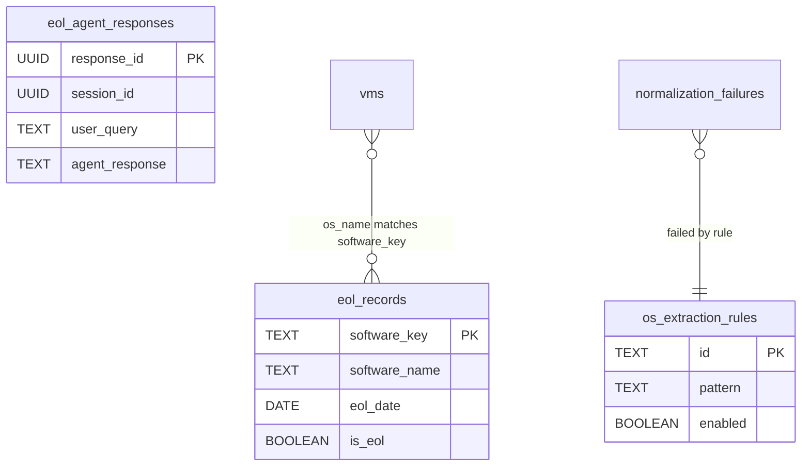

# EOL Domain Schema Design

**Produced by:** P5.4 -- EOL Tables Design
**Phase:** 05-unified-schema-design
**Date:** 2026-03-17
**Requirements:** DB-01, DB-02, DB-03

> Covers end-of-life lifecycle records, agent response persistence, and OS normalization rules.
> Three ACTIVE tables (unchanged), one NEW table, and one supporting table documented.

---

## 1. `eol_records` -- Status: ACTIVE

**Origin:** Migration 001 / bootstrap (DDL identical in both sources)
**Primary Key:** `software_key TEXT`
**Purpose:** EOL lifecycle reference table -- not VM-specific. Maps software identifiers to EOL lifecycle dates. No FK to `vms` because the relationship is many-to-many (many VMs run the same OS; one VM runs one OS). Each record represents one (software_key, version_key) EOL determination with full derivation provenance chain.

**DDL (runtime-authoritative -- `pg_database.py`):**

```sql
CREATE TABLE IF NOT EXISTS eol_records (
    software_key        TEXT            NOT NULL,
    software_name       TEXT,
    vendor              TEXT,
    version             TEXT,
    release_date        DATE,
    eol_date            DATE,
    lts_date            DATE,
    latest_version      TEXT,
    is_eol              BOOLEAN         DEFAULT FALSE,
    support_status      TEXT,
    lifecycle_policy_url TEXT,
    notes               TEXT,
    data_source         TEXT,
    last_checked_at     TIMESTAMPTZ,
    confidence_score    NUMERIC(5, 2),
    raw_response        JSONB,
    os_family           TEXT,
    extended_support_date DATE,
    mainstream_support_date DATE,
    security_update_date DATE,
    successor_product   TEXT,
    migration_guide_url TEXT,
    risk_score          NUMERIC(5, 2),
    created_at          TIMESTAMPTZ     NOT NULL DEFAULT NOW(),
    updated_at          TIMESTAMPTZ     NOT NULL DEFAULT NOW(),
    CONSTRAINT pk_eol_records PRIMARY KEY (software_key)
);
```

**Design Notes:**

- `eol_records` is a **reference table** -- it stores canonical EOL lifecycle data per software product, not per VM. The relationship between VMs and EOL records is logical (via `os_name` matching), not enforced by FK.
- `software_key` is the primary lookup key (e.g., `"windows-server-2019"`, `"ubuntu-20.04"`). It is globally unique per software product/version combination.
- The table supports multiple data sources (`data_source`): endoflife.date API, Microsoft lifecycle API, vendor-specific agents, internet search results.
- `raw_response` JSONB preserves the original API response for audit and re-derivation.
- `confidence_score` and `risk_score` are both NUMERIC(5,2) for consistent precision across the application.

### Existing Indexes

| Index Name | Columns | Type | Purpose |
|------------|---------|------|---------|
| pk_eol_records | software_key | PRIMARY KEY | PK lookup |
| idx_eol_records_vendor | vendor | B-tree | Vendor-based filtering |
| idx_eol_records_is_eol | is_eol | B-tree | EOL status filter |
| idx_eol_records_os_family | os_family | B-tree | OS family grouping |

### Bulk EOL Lookup Pattern (BH-005 fix)

Documents the intended JOIN pattern that replaces the N+1 per-OS EOL lookup in `inventory.html`.

**Current (BH-005 -- N+1):**

```
-- For each row in inventory table:
POST /api/search/eol { "query": row.os_name }  -- 1 HTTP call per unique OS
```

The `inventory.html` page currently calls `checkEOLInPlace()` for each OS row, issuing a separate `POST /api/search/eol` per unique OS name. With 50 OS types this results in 50 sequential HTTP calls and 15s+ page load times (documented in I-INV-01).

**Target (Phase 8/9 implementation):**

```sql
-- Single query: JOIN vms to eol_records via os_name mapping
SELECT v.resource_id, v.vm_name, v.os_name, v.os_type,
       e.is_eol, e.eol_date, e.support_status, e.latest_version
FROM vms v
LEFT JOIN eol_records e
    ON LOWER(v.os_name) = LOWER(e.software_key)
    OR LOWER(v.os_name) LIKE '%' || LOWER(e.software_name) || '%'
WHERE v.subscription_id = $1
ORDER BY v.vm_name;
```

**Design note:** The JOIN condition uses fuzzy matching because `vms.os_name` (from ARG) and `eol_records.software_key` (from endoflife.date API) use different naming conventions. Phase 6 will design the optimal index strategy for this JOIN. Phase 8 will implement the query. The `os_extraction_rules` table provides normalization rules to improve match rates.

**Impact:** Replaces N+1 HTTP calls with a single SQL JOIN, reducing page load from 15s+ to sub-second for the inventory EOL enrichment use case.

---

## 2. `eol_agent_responses` -- Status: NEW

**Origin:** Does not exist today; Phase 7 must CREATE
**Primary Key:** `response_id UUID`
**Purpose:** Persists EOL agent search results for `eol-searches.html`. Without this table, all agent response history is lost on application restart (documented in P1.4 eol-views.md problem P1). Currently, `EolOrchestrator.get_eol_agent_responses()` and `InventoryOrchestrator.get_eol_agent_responses()` store responses in Python lists (in-memory only).

**DDL (NEW -- Phase 7 will CREATE):**

```sql
CREATE TABLE IF NOT EXISTS eol_agent_responses (
    response_id     UUID            NOT NULL DEFAULT gen_random_uuid(),
    session_id      UUID            NOT NULL,
    user_query      TEXT            NOT NULL,
    agent_response  TEXT            NOT NULL,
    sources         JSONB           NOT NULL DEFAULT '[]'::jsonb,
    timestamp       TIMESTAMPTZ     NOT NULL DEFAULT NOW(),
    response_time_ms INTEGER,
    CONSTRAINT pk_eol_agent_responses PRIMARY KEY (response_id)
);
```

Per 05-CONTEXT, this table persists EOL agent search results for `eol-searches.html`. Without it, all agent response history is lost on application restart.

### Key Design Decisions

- **response_id UUID with gen_random_uuid()** -- no dependency on external sequence; generated at INSERT time
- **session_id UUID NOT NULL** -- groups messages into conversations; enables "load previous session" in UI
- **sources JSONB DEFAULT '[]'** -- array of `{title: string, url: string}` objects; enables "where did this come from?" traceability
- **response_time_ms nullable** -- allows tracking slow queries; NULL if timing not captured
- **No FK to any other table** -- standalone chat history; sessions are implicit (any UUID groups messages)
- **No deleted_at** -- hard DELETE of old sessions is acceptable; no audit requirement per 05-CONTEXT

### Indexes

| Index Name | Columns | Type | Purpose |
|------------|---------|------|---------|
| pk_eol_agent_responses | response_id | PRIMARY KEY (B-tree) | PK lookup |
| idx_eol_responses_session | session_id | B-tree | Conversation retrieval |
| idx_eol_responses_timestamp | timestamp DESC | B-tree | Recent queries listing |

### Query Patterns

```sql
-- Load conversation history for a session
SELECT response_id, user_query, agent_response, sources, timestamp, response_time_ms
FROM eol_agent_responses
WHERE session_id = $1
ORDER BY timestamp ASC;

-- List recent sessions (distinct session_ids with latest timestamp)
SELECT DISTINCT ON (session_id) session_id, user_query, timestamp
FROM eol_agent_responses
ORDER BY session_id, timestamp DESC;

-- Insert new response
INSERT INTO eol_agent_responses (session_id, user_query, agent_response, sources, response_time_ms)
VALUES ($1, $2, $3, $4, $5)
RETURNING response_id, timestamp;
```

### Phase Integration

- **Phase 7:** CREATE TABLE + indexes in migration DDL; add to `_REQUIRED_TABLES`
- **Phase 8:** New `EolAgentResponseRepository` class with `save()`, `get_by_session()`, `list_recent_sessions()`, `delete_session()` methods; wire into `EolOrchestrator` and `InventoryOrchestrator` to persist responses on each search
- **Phase 9:** `eol-searches.html` JS switches from `GET /api/eol-agent-responses` (in-memory) to new PG-backed endpoint

---

## 3. `os_extraction_rules` -- Status: ACTIVE

**Origin:** Migration 001 / bootstrap (DDL identical)
**Primary Key:** `id TEXT`
**Purpose:** Custom OS normalization regex rules. Seeded with DEFAULT_OS_EXTRACTION_RULES at bootstrap. Custom rules override defaults by ID. Used by OS normalization pipeline to extract structured OS metadata from raw OS strings (e.g., "Microsoft Windows Server 2019 Datacenter" -> vendor=Microsoft, family=Windows, version=2019).

**DDL (runtime-authoritative -- `pg_database.py`):**

```sql
CREATE TABLE IF NOT EXISTS os_extraction_rules (
    id              TEXT            NOT NULL,
    os_family       TEXT            NOT NULL,
    pattern         TEXT            NOT NULL,
    extraction_rule JSONB           NOT NULL DEFAULT '{}',
    priority        INTEGER         NOT NULL DEFAULT 100,
    enabled         BOOLEAN         NOT NULL DEFAULT TRUE,
    created_at      TIMESTAMPTZ     NOT NULL DEFAULT NOW(),
    updated_at      TIMESTAMPTZ     NOT NULL DEFAULT NOW(),
    CONSTRAINT pk_os_extraction_rules PRIMARY KEY (id)
);
```

**Design Notes:**

- Rules are seeded from `DEFAULT_OS_EXTRACTION_RULES` constant in `utils/os_extraction_rules.py` on first startup
- Custom rules override defaults by matching `id` -- an override replaces the default rule's behavior
- `os_family` groups rules by OS family (e.g., `windows`, `linux`, `macos`)
- `pattern` is a regex pattern matched against raw OS strings
- `extraction_rule` JSONB contains structured extraction configuration (templates, flags, scopes)
- `priority` controls evaluation order (lower number = higher priority); defaults seed at priority 100
- `enabled` allows disabling rules without deleting them
- `os-normalization-rules.html` provides a CRUD interface for managing these rules

### Indexes

| Index Name | Columns | Type | Purpose |
|------------|---------|------|---------|
| pk_os_extraction_rules | id | PRIMARY KEY | PK lookup |
| idx_os_rules_priority | priority ASC | B-tree | Rule evaluation ordering |

---

## 4. `normalization_failures` -- Status: ACTIVE

**Origin:** Migration 015
**Primary Key:** `id BIGSERIAL`
**Purpose:** Tracks OS strings that fail the normalization pipeline. Enables detection of new OS variants that need extraction rule coverage. Has a UNIQUE constraint to prevent duplicate rows for the same (source_table, raw_os_name, raw_os_version) combination.

**DDL (migration 015 -- matches bootstrap):**

```sql
CREATE TABLE IF NOT EXISTS normalization_failures (
    id              BIGSERIAL       PRIMARY KEY,
    source_table    TEXT            NOT NULL,
    raw_os_name     TEXT,
    raw_os_version  TEXT,
    first_seen      TIMESTAMPTZ     NOT NULL DEFAULT NOW(),
    last_seen       TIMESTAMPTZ     NOT NULL DEFAULT NOW(),
    occurrence_count INTEGER        NOT NULL DEFAULT 1,
    UNIQUE (source_table, raw_os_name, raw_os_version)
);
```

**Design Notes:**

- When an OS string fails normalization, a row is inserted or `occurrence_count` is incremented (upsert on UNIQUE constraint)
- `source_table` identifies which table the raw string came from (e.g., `eol_records`, `os_inventory_snapshots`)
- `last_seen` updated on each occurrence to surface recently-failing strings
- Provides input for `os_extraction_rules` maintenance -- new failures indicate rules need updating

### Indexes

| Index Name | Columns | Type | Purpose |
|------------|---------|------|---------|
| normalization_failures_pkey | id | PRIMARY KEY | PK lookup |
| normalization_failures_source_table_raw_os_name_raw_os_version_key | (source_table, raw_os_name, raw_os_version) | UNIQUE | Upsert dedup |
| idx_normalization_failures_last_seen | last_seen | B-tree | Recent failures query |

---

## 5. EOL Domain ERD



### Relationship Notes

- The `vms` <-> `eol_records` relationship is a **logical many-to-many** (via os_name matching), not enforced by FK. The JOIN is computed at query time per the bulk lookup pattern documented in Section 1 (BH-005 fix). Many VMs can share the same OS; each OS maps to one `eol_records` entry. The matching uses fuzzy LOWER() comparison because ARG os_name strings and endoflife.date software_key values use different naming conventions.
- `normalization_failures` tracks OS strings that fail to match any `os_extraction_rules` pattern. The relationship is logical -- failures indicate gaps in rule coverage.
- `eol_agent_responses` is a standalone table with no FK relationships. Sessions are implicit (grouped by `session_id` UUID).
- `os_extraction_rules` has no FK relationships. It is a configuration/reference table consumed by the normalization pipeline.

### Table Summary

| Table | Status | PK | Columns | Phase 7 Action |
|-------|--------|----|---------|----------------|
| `eol_records` | ACTIVE | `software_key` TEXT | 25 | None (unchanged) |
| `eol_agent_responses` | NEW | `response_id` UUID | 7 | CREATE TABLE + indexes |
| `os_extraction_rules` | ACTIVE | `id` TEXT | 8 | None (unchanged) |
| `normalization_failures` | ACTIVE | `id` BIGSERIAL | 7 | None (unchanged) |

---

*Phase: 05-unified-schema-design*
*Plan: 05-04 -- EOL Tables Design*
*Completed: 2026-03-17*
