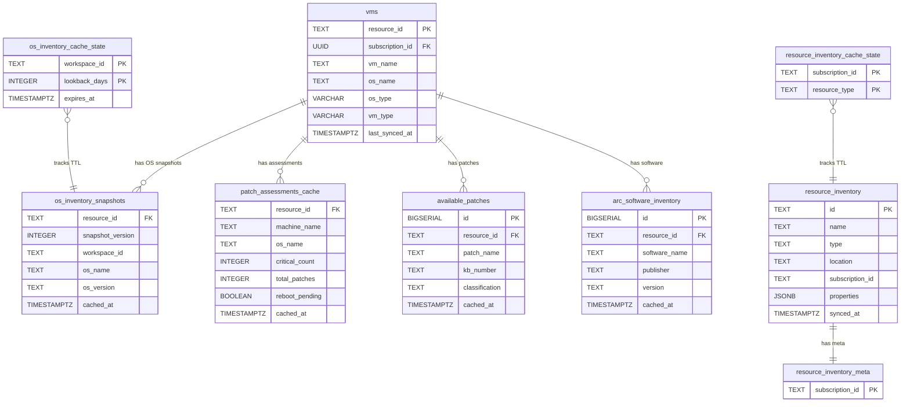

# Inventory Domain Schema Design

**Phase:** P5.3 -- Inventory Tables Design
**Status:** Complete
**Generated:** 2026-03-17

---

## Overview

The inventory domain covers Azure resource metadata, OS snapshots, patch assessments, and software inventory. This document specifies the target schema for all inventory-domain tables, their FK relationships to the `vms` identity spine (P5.1), TTL tier assignments, tables to DROP and DEPRECATE, and the domain ERD.

Tables in this domain fall into three categories:
1. **Active data tables** -- store typed, normalized inventory data with FK to `vms`
2. **State/cache metadata tables** -- track TTL and cache freshness (no FK to `vms`)
3. **Legacy/inactive tables** -- scheduled for DROP or DEPRECATION

---

## 1. `resource_inventory` -- Status: ACTIVE (no structural changes)

### Purpose

Stores ALL Azure resource types discovered via Azure Resource Graph (ARG) -- VMs, storage accounts, networking resources, databases, etc. This is a mixed-type resource catalogue, not a VM-only table.

### DDL

```sql
CREATE TABLE IF NOT EXISTS resource_inventory (
    id              TEXT            NOT NULL,
    name            TEXT,
    type            TEXT,
    location        TEXT,
    resource_group  TEXT,
    subscription_id TEXT,
    properties      JSONB           NOT NULL DEFAULT '{}',
    tags            JSONB           NOT NULL DEFAULT '{}',
    synced_at       TIMESTAMPTZ     NOT NULL DEFAULT NOW(),
    CONSTRAINT pk_resource_inventory PRIMARY KEY (id)
);
```

### NO FK to `vms`

The `resource_inventory` table intentionally has **NO FK to `vms`** for the following reasons:

- `resource_inventory` stores ALL Azure resource types (VMs, storage accounts, networking, etc.) -- not just VMs
- The `id` column is a generic Azure ARM resource ID, not always a VM path
- Only VM-type rows would conceptually FK to `vms`, but the mixed-type nature of this table makes FK impractical
- Phase 8 queries that need VM enrichment should JOIN explicitly:
  ```sql
  SELECT ri.*, v.os_name, v.vm_type
  FROM resource_inventory ri
  JOIN vms v ON ri.id = v.resource_id
  WHERE ri.type LIKE '%virtualMachines%';
  ```

### Indexes

| Index Name | Columns | Type | Purpose |
|------------|---------|------|---------|
| pk_resource_inventory | id | PRIMARY KEY | PK lookup |
| idx_resource_inventory_type | type | B-tree | Type-based filtering |
| idx_resource_inventory_sub | subscription_id | B-tree | Subscription filter |

### Index DDL

```sql
CREATE INDEX IF NOT EXISTS idx_resource_inventory_type
    ON resource_inventory (type);

CREATE INDEX IF NOT EXISTS idx_resource_inventory_sub
    ON resource_inventory (subscription_id);
```

---

## 2. `os_inventory_snapshots` -- Status: MODIFIED (adding FK to vms)

### Purpose

Stores point-in-time OS inventory snapshots from Log Analytics Workspace (LAW) Heartbeat data. Each row represents one VM's OS state at a specific snapshot version and workspace. The `resource_id` column links to the `vms` identity spine.

### DDL

```sql
CREATE TABLE IF NOT EXISTS os_inventory_snapshots (
    resource_id         TEXT            NOT NULL,
    snapshot_version    INTEGER         NOT NULL DEFAULT 1,
    workspace_id        TEXT            NOT NULL,
    computer_name       TEXT,
    os_name             TEXT,
    os_version          TEXT,
    os_type             TEXT,
    kernel_version      TEXT,
    last_heartbeat      TIMESTAMPTZ,
    cached_at           TIMESTAMPTZ     NOT NULL DEFAULT NOW(),
    CONSTRAINT pk_os_inventory_snapshots PRIMARY KEY (resource_id, snapshot_version, workspace_id),
    CONSTRAINT fk_osinvsnap_vm FOREIGN KEY (resource_id)
        REFERENCES vms(resource_id) ON DELETE CASCADE          -- NEW
);
```

### Modifications

- **NEW FK:** `fk_osinvsnap_vm` -- `resource_id` -> `vms(resource_id)` ON DELETE CASCADE
  - When a VM is removed from the `vms` spine, all its OS snapshots are automatically cleaned up
- **TYPE ALIGNMENT:** `resource_id` is already TEXT -- matches `vms.resource_id TEXT`. No type change required.
- **TTL Tier:** MEDIUM_LIVED (3600s / 1h) per TTL-TIERS-SPEC row #7 -- Pattern C (metadata-controlled via `os_inventory_cache_state`)
  - Staleness is delegated to companion table `os_inventory_cache_state.expires_at`
  - Phase 8 should standardize to `get_ttl(CacheTTLProfile.MEDIUM_LIVED)` instead of caller-specified `ttl_seconds`

### `os_name` in this table vs `vms.os_name`

- **`os_inventory_snapshots.os_name`:** Stores the raw LAW-reported OS name at snapshot time. This is the unprocessed value from the KQL Heartbeat query (e.g., `"Ubuntu 20.04.6 LTS"`, `"Microsoft Windows Server 2022 Datacenter"`)
- **`vms.os_name`:** Stores the normalized canonical OS name used for query-time filtering and EOL lookup (e.g., `"Ubuntu 20.04"`, `"Windows Server 2022"`)
- Both are needed -- this table for raw historical data, `vms` for canonical identity

### Indexes

| Index Name | Columns | Type | Purpose |
|------------|---------|------|---------|
| pk_os_inventory_snapshots | (resource_id, snapshot_version, workspace_id) | PRIMARY KEY | Composite PK |
| idx_osinvsnap_resource | resource_id | B-tree | VM lookup |
| idx_osinvsnap_cached | cached_at | B-tree | Staleness queries |

### Index DDL

```sql
CREATE INDEX IF NOT EXISTS idx_osinvsnap_resource
    ON os_inventory_snapshots (resource_id);

CREATE INDEX IF NOT EXISTS idx_osinvsnap_cached
    ON os_inventory_snapshots (cached_at);
```

### Phase 7 Migration

```sql
-- Add FK constraint (table already exists)
ALTER TABLE os_inventory_snapshots
    ADD CONSTRAINT fk_osinvsnap_vm
    FOREIGN KEY (resource_id) REFERENCES vms(resource_id) ON DELETE CASCADE;
```

> **Pre-condition:** `vms` table must exist and be populated before adding this FK. Orphan rows in `os_inventory_snapshots` with `resource_id` values not in `vms` must be cleaned up first:
> ```sql
> DELETE FROM os_inventory_snapshots
> WHERE resource_id NOT IN (SELECT resource_id FROM vms);
> ```

---

## 3. `patch_assessments_cache` -- Status: MODIFIED (FK to vms + type change)

### Purpose

Stores per-VM patch assessment summaries from Azure Resource Graph (ARG). One row per VM with aggregate patch counts (critical, high, medium, low, other), assessment status, and reboot state. Populated by `ARGPatchSyncJob` every 15 minutes.

### DDL

```sql
CREATE TABLE IF NOT EXISTS patch_assessments_cache (
    resource_id         TEXT            NOT NULL,     -- TYPE CHANGE: was VARCHAR(512)
    machine_name        TEXT,
    os_name             TEXT,
    os_version          TEXT,
    vm_type             TEXT,
    assessment_status   TEXT,
    last_assessment     TIMESTAMPTZ,
    critical_count      INTEGER         DEFAULT 0,
    high_count          INTEGER         DEFAULT 0,
    medium_count        INTEGER         DEFAULT 0,
    low_count           INTEGER         DEFAULT 0,
    other_count         INTEGER         DEFAULT 0,
    total_patches       INTEGER         DEFAULT 0,
    reboot_pending      BOOLEAN         DEFAULT FALSE,
    cached_at           TIMESTAMPTZ     NOT NULL DEFAULT NOW(),
    CONSTRAINT pk_patch_assessments_cache PRIMARY KEY (resource_id),
    CONSTRAINT fk_patchcache_vm FOREIGN KEY (resource_id)
        REFERENCES vms(resource_id) ON DELETE CASCADE          -- NEW
);
```

### Modifications

- **TYPE CHANGE:** `resource_id` from VARCHAR(512) to TEXT for consistency with `vms.resource_id TEXT`. PostgreSQL stores TEXT and VARCHAR identically (both use `varlena` storage), so this is a metadata-only operation -- no table rewrite required.
- **NEW FK:** `fk_patchcache_vm` -- `resource_id` -> `vms(resource_id)` ON DELETE CASCADE
  - Deleting a VM from the spine automatically removes its cached patch assessment
- **TTL Tier:** MEDIUM_LIVED (3600s / 1h) per TTL-TIERS-SPEC row #2 -- Pattern B (`cached_at` + TTL comparison)
  - Staleness check at query time: `WHERE cached_at > NOW() - INTERVAL '3600 seconds'`
  - Sync job writes every 15 min, so data is always fresher than the 1h TTL

### Phase 7 Migration

```sql
-- Step 1: Type change (metadata-only for varlena types)
ALTER TABLE patch_assessments_cache ALTER COLUMN resource_id TYPE TEXT;

-- Step 2: Clean up orphan rows
DELETE FROM patch_assessments_cache
WHERE resource_id NOT IN (SELECT resource_id FROM vms);

-- Step 3: Add FK constraint
ALTER TABLE patch_assessments_cache
    ADD CONSTRAINT fk_patchcache_vm
    FOREIGN KEY (resource_id) REFERENCES vms(resource_id) ON DELETE CASCADE;
```

### Indexes

| Index Name | Columns | Type | Purpose |
|------------|---------|------|---------|
| pk_patch_assessments_cache | resource_id | PRIMARY KEY | PK lookup |
| idx_patchcache_cached | cached_at | B-tree | Staleness queries |
| idx_patchcache_os | os_name | B-tree | OS-based filtering |

### Index DDL

```sql
CREATE INDEX IF NOT EXISTS idx_patchcache_cached
    ON patch_assessments_cache (cached_at);

CREATE INDEX IF NOT EXISTS idx_patchcache_os
    ON patch_assessments_cache (os_name);
```

---

## 4. `available_patches` -- Status: MODIFIED (FK target change)

### Purpose

Stores per-VM per-patch detail records from Azure Resource Graph (ARG). One row per (VM, patch) combination. Populated by `ARGPatchSyncJob` every 15 minutes alongside `patch_assessments_cache`. Used by `KBCVEInferenceJob` to identify VMs with uninstalled patches for CVE detection.

### DDL

```sql
CREATE TABLE IF NOT EXISTS available_patches (
    id                  BIGSERIAL       PRIMARY KEY,
    resource_id         TEXT            NOT NULL,
    patch_name          TEXT,
    kb_number           TEXT,
    classification      TEXT,
    severity            TEXT,
    reboot_required     BOOLEAN         DEFAULT FALSE,
    published_date      TIMESTAMPTZ,
    cached_at           TIMESTAMPTZ     NOT NULL DEFAULT NOW(),
    CONSTRAINT fk_availpatches_vm FOREIGN KEY (resource_id)
        REFERENCES vms(resource_id) ON DELETE CASCADE          -- CHANGED: was FK to patch_assessments_cache
);
```

### Modifications

- **FK TARGET CHANGE:** Previously `resource_id` FK'd to `patch_assessments_cache(resource_id)` per migration 011. Target schema FKs directly to `vms(resource_id)` -- cleaner relationship, avoids transitive dependency. A patch record is associated with a VM, not with a patch assessment cache entry. If the assessment cache is cleared/repopulated, patches should not be orphaned.
- **TTL Tier:** MEDIUM_LIVED (3600s / 1h) per TTL-TIERS-SPEC row #3 -- Pattern B (`cached_at` + TTL comparison)
  - Staleness check: `WHERE cached_at > NOW() - INTERVAL '3600 seconds'`

### Phase 7 Migration

```sql
-- Step 1: Drop existing FK to patch_assessments_cache (if exists)
ALTER TABLE available_patches
    DROP CONSTRAINT IF EXISTS fk_available_patches_resource;

-- Step 2: Clean up orphan rows
DELETE FROM available_patches
WHERE resource_id NOT IN (SELECT resource_id FROM vms);

-- Step 3: Add new FK to vms
ALTER TABLE available_patches
    ADD CONSTRAINT fk_availpatches_vm
    FOREIGN KEY (resource_id) REFERENCES vms(resource_id) ON DELETE CASCADE;
```

### Indexes

| Index Name | Columns | Type | Purpose |
|------------|---------|------|---------|
| available_patches_pkey | id | PRIMARY KEY | PK |
| idx_availpatches_resource | resource_id | B-tree | VM lookup |
| idx_availpatches_kb | kb_number | B-tree | KB number lookup |
| idx_availpatches_cached | cached_at | B-tree | Staleness queries |

### Index DDL

```sql
CREATE INDEX IF NOT EXISTS idx_availpatches_resource
    ON available_patches (resource_id);

CREATE INDEX IF NOT EXISTS idx_availpatches_kb
    ON available_patches (kb_number);

CREATE INDEX IF NOT EXISTS idx_availpatches_cached
    ON available_patches (cached_at);
```

---

## 5. `arc_software_inventory` -- Status: MODIFIED (adding FK to vms)

### Purpose

Stores per-VM software inventory records from Log Analytics Workspace (LAW) `ConfigurationData` queries. Each row represents one software package installed on one VM. Populated by `LAWSoftwareInventorySyncJob` every 15 minutes. Records where `software_type = 'Patch'` are used by `KBCVEInferenceJob` to detect resolved CVEs.

### DDL

```sql
CREATE TABLE IF NOT EXISTS arc_software_inventory (
    id                  BIGSERIAL       PRIMARY KEY,
    resource_id         TEXT            NOT NULL,
    software_name       TEXT,
    publisher           TEXT,
    version             TEXT,
    install_date        TEXT,
    cached_at           TIMESTAMPTZ     NOT NULL DEFAULT NOW(),
    CONSTRAINT fk_arcswinv_vm FOREIGN KEY (resource_id)
        REFERENCES vms(resource_id) ON DELETE CASCADE          -- NEW
);
```

### Modifications

- **NEW FK:** `fk_arcswinv_vm` -- `resource_id` -> `vms(resource_id)` ON DELETE CASCADE
  - Deleting a VM from the spine automatically removes all its software inventory records
- **TTL Tier:** MEDIUM_LIVED (3600s / 1h) per TTL-TIERS-SPEC row #9 -- Pattern B (`cached_at` + TTL comparison)
  - Staleness check: `WHERE cached_at > NOW() - INTERVAL '3600 seconds'`
  - Sync job writes every 15 min, so data is always fresher than the 1h TTL

### Phase 7 Migration

```sql
-- Clean up orphan rows
DELETE FROM arc_software_inventory
WHERE resource_id NOT IN (SELECT resource_id FROM vms);

-- Add FK constraint
ALTER TABLE arc_software_inventory
    ADD CONSTRAINT fk_arcswinv_vm
    FOREIGN KEY (resource_id) REFERENCES vms(resource_id) ON DELETE CASCADE;
```

### Indexes

| Index Name | Columns | Type | Purpose |
|------------|---------|------|---------|
| arc_software_inventory_pkey | id | PRIMARY KEY | PK |
| idx_arcswinv_resource | resource_id | B-tree | VM lookup |
| idx_arcswinv_cached | cached_at | B-tree | Staleness queries |

### Index DDL

```sql
CREATE INDEX IF NOT EXISTS idx_arcswinv_resource
    ON arc_software_inventory (resource_id);

CREATE INDEX IF NOT EXISTS idx_arcswinv_cached
    ON arc_software_inventory (cached_at);
```

---

## 6. State/Cache Metadata Tables -- Status: ACTIVE (unchanged, no FK to vms)

These tables track cache state, TTL metadata, or store JSONB blob caches. They do not reference individual VMs via FK and require no structural changes in the target schema.

### 6.1 `resource_inventory_meta`

- **Purpose:** Scan metadata per subscription (last scan time, record count)
- **PK:** `subscription_id TEXT`
- **Status:** ACTIVE -- no changes needed

### 6.2 `resource_inventory_cache_state`

- **Purpose:** TTL state per resource-type per subscription
- **PK:** Composite `(subscription_id, resource_type)`
- **Status:** ACTIVE -- no changes needed

### 6.3 `os_inventory_cache_state`

- **Purpose:** TTL tracker for `os_inventory_snapshots` (Pattern C metadata table)
- **PK:** Composite `(workspace_id, lookback_days)`
- **Status:** ACTIVE -- no changes needed

### 6.4 `inventory_software_cache`

- **Purpose:** ARG software blob cache (Cosmos replacement)
- **PK:** `cache_key TEXT`
- **Status:** ACTIVE
- **Phase 8 change:** Reduce TTL from 4h (14400s) to 1h (3600s) to align with MEDIUM_LIVED tier

### 6.5 `inventory_os_cache`

- **Purpose:** ARG OS blob cache (Cosmos replacement)
- **PK:** `cache_key TEXT`
- **Status:** ACTIVE
- **Phase 8 change:** Reduce TTL from 4h (14400s) to 1h (3600s) to align with MEDIUM_LIVED tier

---

## 7. Tables to DROP (Phase 7)

These tables are INACTIVE -- no Python code reads or writes to them. They should be dropped in the Phase 7 migration.

| Table | Status | Reason | Pre-Condition |
|-------|--------|--------|---------------|
| `arc_os_inventory` | DROP | INACTIVE -- no write path, no sync job (confirmed P2.2). OS data is already covered by `os_inventory_snapshots` (active, richer schema, bootstrap-guaranteed). | None -- safe to drop |
| `patch_assessment_history` | DROP | INACTIVE -- no Python code reads or writes (confirmed P2.2). Created by migration 011 but never wired. | None -- safe to drop |

### DROP SQL

```sql
DROP TABLE IF EXISTS arc_os_inventory;
DROP TABLE IF EXISTS patch_assessment_history;
```

---

## 8. Tables to DEPRECATE (Phase 10)

These tables are superseded by typed, normalized replacements. They are kept during the transition period (Phases 7-9) for backward compatibility with existing consumers, then dropped in Phase 10 after all consumers are migrated.

| Table | Status | Reason | Replacement | Phase 10 Action |
|-------|--------|--------|-------------|----------------|
| `inventory_vm_metadata` | DEPRECATED | Replaced by `vms` spine (P5.1). All columns map to `vms` or domain-specific tables. 6 consumers identified with Phase 7/8/9 migration paths. | `vms` + domain-specific joins | DROP after Phase 9 consumer migration |
| `arg_cache` | DEPRECATED | Generic JSONB blob cache; zero active callers confirmed in Phase 4 audit. Typed tables `patch_assessments_cache` + `available_patches` provide superior query support. | `patch_assessments_cache` + `available_patches` | DROP |
| `law_cache` | DEPRECATED | Generic JSONB blob cache; no confirmed active callers. Typed tables `os_inventory_snapshots` + `arc_software_inventory` are the active data path. | `os_inventory_snapshots` + `arc_software_inventory` | DROP |
| `patch_assessments` | DEPRECATED | Legacy JSONB blob with `data JSONB` column. Superseded by `patch_assessments_cache` (18 typed columns). Still read by `v_unified_vm_inventory` CTE. | `patch_assessments_cache` (typed) | DROP after `v_unified_vm_inventory` rewired in Phase 9 |

### Deprecation Timeline

1. **Phase 7:** Keep all 4 tables. Do not drop. Add deprecation comments to bootstrap DDL.
2. **Phase 8:** Redirect all repository write paths from deprecated tables to canonical replacements.
3. **Phase 9:** Rewire `v_unified_vm_inventory` to read from `vms` + `patch_assessments_cache`. Confirm UI integration works against new tables.
4. **Phase 10:** `DROP TABLE IF EXISTS` for all 4 deprecated tables after confirming zero remaining consumers.

---

## 9. Inventory Domain ERD



---

## Summary

### Active/Modified Tables (5)

| # | Table | Status | FK to vms | TTL Tier | Pattern |
|---|-------|--------|-----------|----------|---------|
| 1 | `resource_inventory` | ACTIVE (unchanged) | No (mixed resource types) | N/A | N/A |
| 2 | `os_inventory_snapshots` | MODIFIED (+FK) | `fk_osinvsnap_vm` CASCADE | MEDIUM_LIVED (1h) | C (metadata) |
| 3 | `patch_assessments_cache` | MODIFIED (+FK, +type change) | `fk_patchcache_vm` CASCADE | MEDIUM_LIVED (1h) | B (cached_at) |
| 4 | `available_patches` | MODIFIED (FK target change) | `fk_availpatches_vm` CASCADE | MEDIUM_LIVED (1h) | B (cached_at) |
| 5 | `arc_software_inventory` | MODIFIED (+FK) | `fk_arcswinv_vm` CASCADE | MEDIUM_LIVED (1h) | B (cached_at) |

### Unchanged State/Cache Tables (5)

| # | Table | PK | Phase 8 Change |
|---|-------|-----|----------------|
| 1 | `resource_inventory_meta` | `subscription_id` | None |
| 2 | `resource_inventory_cache_state` | `(subscription_id, resource_type)` | None |
| 3 | `os_inventory_cache_state` | `(workspace_id, lookback_days)` | None |
| 4 | `inventory_software_cache` | `cache_key` | Reduce TTL 4h -> 1h |
| 5 | `inventory_os_cache` | `cache_key` | Reduce TTL 4h -> 1h |

### DROP (2 tables, Phase 7) | DEPRECATE (4 tables, Phase 10)

See sections 7 and 8 above.

---

*Inventory Domain Schema Design*
*Phase: 05-unified-schema-design / P5.3*
*Completed: 2026-03-17*
