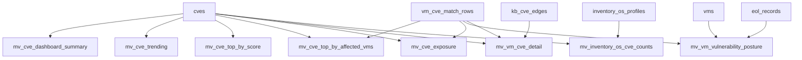

# Materialized View Target Design

**Phase:** P5.6 -- Materialized View Set Design
**Status:** Complete
**Generated:** 2026-03-17
**Sources:** MATERIALIZED-VIEWS.md (P2.3), VM-IDENTITY-SPINE.md (P5.1), 05-CONTEXT.md, 05-RESEARCH.md

---

## Overview

Consolidates from 10 MVs (7 bootstrap + 3 migration-011) down to **7 bootstrap MVs**. The 3 migration-011 MVs are dropped (no active callers). `mv_vm_vulnerability_posture` is updated to source from `vms` instead of `inventory_vm_metadata`.

**Key changes from current state:**
1. `mv_vm_vulnerability_posture` DDL rewritten -- source changed from `inventory_vm_metadata` to `vms`, with `eol_records` JOIN for EOL data
2. 3 migration-011 MVs (`vm_vulnerability_overview`, `cve_dashboard_stats`, `os_cve_inventory_counts`) added to DROP list
3. 15-minute APScheduler refresh schedule for all 7 MVs
4. Manual refresh API endpoints specified
5. I-03 ownership fix strategy documented
6. `v_unified_vm_inventory` deprecated

---

## Retained MVs Summary

| # | MV Name | Status | Source Tables | Change |
|---|---------|--------|---------------|--------|
| 1 | mv_cve_dashboard_summary | RETAINED | cves | None |
| 2 | mv_cve_trending | RETAINED | cves | None |
| 3 | mv_cve_top_by_score | RETAINED | cves | None |
| 4 | mv_cve_top_by_affected_vms | RETAINED | vm_cve_match_rows, cves | None |
| 5 | mv_cve_exposure | RETAINED | vm_cve_match_rows, cves | None |
| 6 | mv_vm_vulnerability_posture | RETAINED | vms, vm_cve_match_rows, eol_records | **MODIFIED: source changed from inventory_vm_metadata to vms** |
| 7 | mv_vm_cve_detail | RETAINED | vm_cve_match_rows, cves, kb_cve_edges | None (already uses LEFT JOIN from migration 025) |

---

## 6 Unchanged MVs (DDL retained as-is)

Each MV below retains its current canonical DDL from prior migrations. Full DDL is documented in [MATERIALIZED-VIEWS.md](../../02-schema-repository-audit/schema/MATERIALIZED-VIEWS.md). All 6 support CONCURRENT refresh via unique index.

### 1. mv_cve_dashboard_summary

**Status:** RETAINED -- no changes
**Source:** `cves`
**Canonical DDL:** Migration 023 (rebuilt from scan-scoped to full catalogue)
**Unique Index:** `mv_cve_dashboard_summary_unique_idx` ON `(last_updated)` -- single-row aggregate
**CONCURRENT refresh:** Yes

Single-row aggregate of the entire CVE catalogue: total count, severity breakdown (critical/high/medium/low), aging distribution by publication date. Feeds the main CVE dashboard summary widgets.

### 2. mv_cve_trending

**Status:** RETAINED -- no changes
**Source:** `cves`
**Canonical DDL:** Migration 023 (rebuilt from scan-scoped to full catalogue)
**Unique Index:** `mv_cve_trending_bucket_date_unique_idx` ON `(bucket_date)`
**CONCURRENT refresh:** Yes

Daily publication-date histogram of the full CVE catalogue. Each row is one calendar day with CVE count and severity breakdown. Used for the trending chart on the CVE dashboard.

### 3. mv_cve_top_by_score

**Status:** RETAINED -- no changes
**Source:** `cves`
**Canonical DDL:** Migration 023 (with migration 024 unique index)
**Unique Index:** `mv_cve_top_by_score_cve_id_idx` ON `(cve_id)`
**CONCURRENT refresh:** Yes

All CVEs with non-null CVSS v3 score, ordered by score descending. Used by the dashboard "Top CVEs" table.

### 4. mv_cve_top_by_affected_vms

**Status:** RETAINED -- no changes
**Source:** `vm_cve_match_rows`, `cves`
**Canonical DDL:** Migration 007
**Unique Index:** `mv_cve_top_by_affected_vms_cve_id_idx` ON `(cve_id)`
**CONCURRENT refresh:** Yes

Per-CVE affected VM count from the latest scan. Feeds dashboard top-CVE-by-affected-VMs tables.

### 5. mv_cve_exposure

**Status:** RETAINED -- no changes
**Source:** `vm_cve_match_rows`, `cves`
**Canonical DDL:** Migration 007
**Unique Index:** `mv_cve_exposure_cve_id_idx` ON `(cve_id)`
**CONCURRENT refresh:** Yes

Per-CVE exposure metrics for the latest completed scan: affected VMs, patched VMs, unpatched VMs. Uses `latest_completed_scan_id()` function.

### 6. mv_vm_cve_detail

**Status:** RETAINED -- no changes (already uses LEFT JOIN from migration 025)
**Source:** `vm_cve_match_rows`, `cves`, `kb_cve_edges`
**Canonical DDL:** Migration 025 (LEFT JOIN fix)
**Unique Index:** `mv_vm_cve_detail_scan_vm_cve_idx` ON `(scan_id, vm_id, cve_id)`
**CONCURRENT refresh:** Yes

All VM+CVE match rows enriched with CVE metadata. LEFT JOIN ensures all scan match rows are visible regardless of CVE sync status. `has_kb_patch` flag from `kb_cve_edges` subquery.

---

## Updated mv_vm_vulnerability_posture DDL

**Status:** RETAINED -- **MODIFIED**
**Source:** `vms`, `vm_cve_match_rows`, `eol_records`
**Change:** Source table changed from `inventory_vm_metadata` to `vms`; EOL data via JOIN to `eol_records`

### Target DDL

```sql
DROP MATERIALIZED VIEW IF EXISTS mv_vm_vulnerability_posture;
CREATE MATERIALIZED VIEW mv_vm_vulnerability_posture AS
SELECT
  vm.resource_id                                                          AS vm_id,
  vm.vm_name,
  vm.vm_type,
  vm.os_name,
  vm.os_type,
  vm.location,
  vm.resource_group,
  vm.subscription_id,
  vm.last_synced_at,
  COALESCE(agg.total_cves, 0)         AS total_cves,
  COALESCE(agg.critical, 0)           AS critical,
  COALESCE(agg.high, 0)               AS high,
  COALESCE(agg.medium, 0)             AS medium,
  COALESCE(agg.low, 0)                AS low,
  COALESCE(agg.unpatched, 0)          AS unpatched,
  COALESCE(agg.unpatched_critical, 0) AS unpatched_critical,
  COALESCE(agg.unpatched_high, 0)     AS unpatched_high,
  CASE
    WHEN COALESCE(agg.critical, 0) > 0
     AND COALESCE(agg.unpatched_critical, 0) > 0 THEN 'Critical'
    WHEN COALESCE(agg.high, 0) > 0
     AND COALESCE(agg.unpatched_high, 0) > 0     THEN 'High'
    WHEN COALESCE(agg.total_cves, 0) > 0         THEN 'Medium'
    ELSE 'Healthy'
  END AS risk_level,
  e.is_eol                            AS eol_status,
  e.eol_date                          AS eol_date,
  NOW() AS last_updated
FROM vms vm
LEFT JOIN (
  SELECT
    vm_id,
    COUNT(DISTINCT cve_id)                                                              AS total_cves,
    COUNT(DISTINCT CASE WHEN severity = 'CRITICAL' THEN cve_id END)                    AS critical,
    COUNT(DISTINCT CASE WHEN severity = 'HIGH'     THEN cve_id END)                    AS high,
    COUNT(DISTINCT CASE WHEN severity = 'MEDIUM'   THEN cve_id END)                    AS medium,
    COUNT(DISTINCT CASE WHEN severity = 'LOW'      THEN cve_id END)                    AS low,
    COUNT(DISTINCT CASE WHEN patch_status NOT IN ('installed') THEN cve_id END)        AS unpatched,
    COUNT(DISTINCT CASE WHEN severity = 'CRITICAL'
                         AND patch_status NOT IN ('installed') THEN cve_id END)        AS unpatched_critical,
    COUNT(DISTINCT CASE WHEN severity = 'HIGH'
                         AND patch_status NOT IN ('installed') THEN cve_id END)        AS unpatched_high
  FROM vm_cve_match_rows
  WHERE scan_id = latest_completed_scan_id()
  GROUP BY vm_id
) agg ON agg.vm_id = vm.resource_id
LEFT JOIN eol_records e ON LOWER(vm.os_name) = LOWER(e.software_key);

CREATE UNIQUE INDEX mv_vm_vulnerability_posture_vm_id_idx
    ON mv_vm_vulnerability_posture (vm_id);
CREATE INDEX mv_vm_vulnerability_posture_risk_total_idx
    ON mv_vm_vulnerability_posture (risk_level, total_cves DESC);
CREATE INDEX mv_vm_vulnerability_posture_sub_rg_idx
    ON mv_vm_vulnerability_posture (subscription_id, resource_group);
CREATE INDEX mv_vm_vulnerability_posture_vm_type_idx
    ON mv_vm_vulnerability_posture (vm_type);
```

**CONCURRENT refresh:** Yes (unique index on `vm_id`)

### Key changes from current DDL

| # | Change | Detail |
|---|--------|--------|
| 1 | **Source table** | `FROM vms vm` (was `FROM inventory_vm_metadata vm`) |
| 2 | **Removed columns** | `os_version` (not in `vms` -- stays in `os_inventory_snapshots`) |
| 3 | **Removed** | `COALESCE(m.vm_name, vm.vm_name)` pattern -- `vms.vm_name` is canonical; no LATERAL JOIN for vm_name from scan rows |
| 4 | **Added** | `LEFT JOIN eol_records e` for `eol_status` and `eol_date` -- previously denormalized in `inventory_vm_metadata`, now computed via JOIN |
| 5 | **eol_status column** | Changed from `vm.eol_status TEXT` to `e.is_eol BOOLEAN` aliased as `eol_status`. **API response shape impact:** If API currently returns eol_status as a string ('EOL', 'Supported'), Phase 8 must map `is_eol BOOLEAN` to the expected string format. If API returns a boolean, no mapping needed. |
| 6 | **eol_date column** | `e.eol_date DATE` via JOIN (was `vm.eol_date DATE` from inventory_vm_metadata) |

### Phase 8/9 action

Verify API response shape for `eol_status` field. If string-based, the MV or repository query must CASE-map:
```sql
CASE WHEN e.is_eol THEN 'EOL' ELSE 'Supported' END AS eol_status
```

---

## Migration-011 MVs to DROP

| MV Name | Status | Reason | Pre-Condition |
|---------|--------|--------|---------------|
| vm_vulnerability_overview | DROP | No active callers; superseded by mv_vm_vulnerability_posture | Grep confirms no API/router references |
| cve_dashboard_stats | DROP | No active callers; superseded by mv_cve_dashboard_summary | Grep confirms no API/router references |
| os_cve_inventory_counts | DROP | No active callers; superseded by mv_inventory_os_cve_counts | Grep confirms no API/router references |

### Phase 7 verification checklist (MUST complete before DROP)

1. `grep -r "vm_vulnerability_overview" app/agentic/eol/ --include="*.py"` -- expect 0 results outside migration files
2. `grep -r "cve_dashboard_stats" app/agentic/eol/ --include="*.py"` -- expect 0 results outside migration files
3. `grep -r "os_cve_inventory_counts" app/agentic/eol/ --include="*.py"` -- expect 0 results outside migration/docs files (note: `mv_inventory_os_cve_counts` is the bootstrap equivalent with different name)

### DROP DDL

```sql
DROP MATERIALIZED VIEW IF EXISTS vm_vulnerability_overview;
DROP MATERIALIZED VIEW IF EXISTS cve_dashboard_stats;
DROP MATERIALIZED VIEW IF EXISTS os_cve_inventory_counts;
```

### Phase 8 action

Remove `KBCVEInferenceJob._refresh_materialized_views()` call that refreshes these 3 MVs (or rewire it to refresh the bootstrap 7 MVs if appropriate). The inference job currently refreshes:

```python
views = [
    'vm_vulnerability_overview',
    'cve_dashboard_stats',
    'os_cve_inventory_counts',
]
```

After Phase 7 drops these MVs, the inference job refresh list must be updated to either:
- Remove the 3-MV refresh entirely (if inference output feeds into bootstrap MVs via `vm_cve_match_rows`)
- Replace with bootstrap MV names (if inference output warrants a dedicated refresh trigger)

---

## Refresh Schedule

| MV | Refresh Interval | Trigger | CONCURRENT? |
|----|-----------------|---------|-------------|
| mv_cve_dashboard_summary | 15 minutes | APScheduler periodic job | Yes (unique index on last_updated) |
| mv_cve_trending | 15 minutes | APScheduler periodic job | Yes (unique index on bucket_date) |
| mv_cve_top_by_score | 15 minutes | APScheduler periodic job | Yes (unique index on cve_id) |
| mv_cve_top_by_affected_vms | 15 minutes | APScheduler periodic job | Yes (unique index on cve_id) |
| mv_cve_exposure | 15 minutes | APScheduler periodic job | Yes (unique index on cve_id) |
| mv_vm_vulnerability_posture | 15 minutes | APScheduler periodic job | Yes (unique index on vm_id) |
| mv_vm_cve_detail | 15 minutes | APScheduler periodic job | Yes (unique index on scan_id, vm_id, cve_id) |

**Additional refresh trigger:** After every completed CVE scan (`PostgresVMCVEMatchRepository.refresh_materialized_views()` -- existing behavior retained).

Per 05-CONTEXT: No real-time triggers (avoids write performance impact). APScheduler provides predictable refresh cadence. Manual API handles "need fresh data now" scenarios.

---

## Manual Refresh API Endpoints

| Method | Path | Action |
|--------|------|--------|
| POST | /api/admin/mv/refresh/dashboard | Refresh mv_cve_dashboard_summary, mv_cve_trending, mv_cve_top_by_score, mv_cve_top_by_affected_vms, mv_cve_exposure |
| POST | /api/admin/mv/refresh/inventory | Refresh mv_vm_vulnerability_posture, mv_vm_cve_detail |
| POST | /api/admin/mv/refresh/all | Refresh all 7 MVs |

### Response format

```json
{
    "refreshed": ["mv_cve_dashboard_summary", "mv_cve_trending"],
    "duration_ms": 1234,
    "status": "success"
}
```

### Error response

```json
{
    "refreshed": ["mv_cve_dashboard_summary"],
    "failed": ["mv_cve_trending"],
    "errors": {"mv_cve_trending": "ownership check failed"},
    "duration_ms": 567,
    "status": "partial"
}
```

---

## I-03 Ownership Fix Strategy

### Problem

`pg_database.py` startup DROP+CREATE recreates MVs as superuser, defeating migration ownership fixes (024/026). Runtime role cannot REFRESH CONCURRENTLY on MVs owned by superuser.

### Root Cause Chain

1. `pg_database.py` startup calls `_apply_mv_vm_cve_detail_left_join()` which drops and recreates `mv_vm_cve_detail`
2. Recreated MV is owned by the startup connection role (typically superuser)
3. Runtime role `aad_postgres_flexible_eol` cannot refresh CONCURRENTLY (ownership check fails)
4. Migrations 024/026 fix ownership at migration time, but startup re-creation reverts it
5. `ALTER MATERIALIZED VIEW ... OWNER TO` requires superuser -- circular dependency

### Fix (Phase 7) -- Recommended Approach: Idempotent Bootstrap

**Option 3 (Recommended):** Modify `pg_database.py` to check if MV exists before CREATE. If MV exists, skip creation (preserving ownership). Only CREATE if MV is missing (fresh deployment).

Implementation steps:
1. Before each `CREATE MATERIALIZED VIEW`, query `pg_matviews`:
   ```sql
   SELECT 1 FROM pg_matviews WHERE matviewname = $1;
   ```
2. If row exists: SKIP the CREATE (MV already exists with correct ownership from migration)
3. If row does NOT exist: CREATE the MV, then immediately:
   ```sql
   ALTER MATERIALIZED VIEW {mv_name} OWNER TO CURRENT_ROLE;
   ```
4. Phase 7 migration DDL must include `ALTER MATERIALIZED VIEW ... OWNER TO CURRENT_ROLE;` after every CREATE MATERIALIZED VIEW

**Alternative approaches (documented for completeness):**

| Option | Approach | Tradeoff |
|--------|----------|----------|
| Option 1 | Add `ALTER ... OWNER TO CURRENT_ROLE` after every CREATE | Requires runtime role to have ALTER privilege; works if startup runs as runtime role |
| Option 2 | `pg_database.py` bootstrap runs `ALTER ... OWNER TO {runtime_role}` after MV creation | Requires knowing runtime role name at bootstrap time; hardcodes role name |
| **Option 3** | Check `pg_matviews` before CREATE; skip if exists | **Recommended** -- preserves migration ownership, no hardcoded roles, idempotent |

---

## v_unified_vm_inventory Fate

**Status:** DEPRECATED -- replaced by `vms` table queries.

The regular view `v_unified_vm_inventory` (20-column view sourcing from `inventory_vm_metadata`, `patch_assessments`, `os_inventory_snapshots`) will be replaced by direct queries against the `vms` table with JOINs to domain tables. The `INVENTORY_USE_UNIFIED_VIEW` feature flag (I-02) becomes irrelevant -- Phase 9 removes it.

### Deprecation Timeline

| Phase | Action |
|-------|--------|
| Phase 7 | Do NOT drop the view yet (callers still reference it) |
| Phase 9 | Rewire all callers to use `vms` + domain table JOINs |
| Phase 10 | `DROP VIEW IF EXISTS v_unified_vm_inventory;` after confirming zero remaining consumers |

---

## MV Source Dependency Diagram



> **Note:** `mv_inventory_os_cve_counts` is included in the dependency diagram for completeness. It is the 8th bootstrap MV (created by migration 011 but included in the `PostgresVMCVEMatchRepository._MATERIALIZED_VIEWS` refresh list). It is RETAINED and unchanged.

---

## Bootstrap Refresh List (Target State)

The `PostgresVMCVEMatchRepository._MATERIALIZED_VIEWS` list remains unchanged:

```python
_MATERIALIZED_VIEWS = [
    "mv_inventory_os_cve_counts",
    "mv_cve_dashboard_summary",
    "mv_cve_top_by_score",
    "mv_cve_exposure",
    "mv_cve_trending",
    "mv_vm_vulnerability_posture",
    "mv_vm_cve_detail",
]
```

All 7 MVs support CONCURRENT refresh via unique indexes.

---

*Materialized View Target Design*
*Phase: 05-unified-schema-design / P5.6*
*Completed: 2026-03-17*
