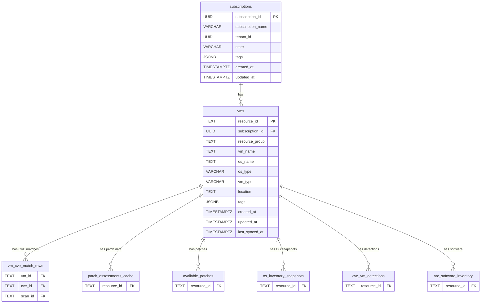

# VM Identity Spine Design

**Phase:** P5.1 — VM Identity Spine
**Status:** Complete
**Generated:** 2026-03-17

---

## Overview

The VM identity spine is the foundational schema layer that all domain tables reference. It consists of two tables:
1. **`vms`** — Canonical source-of-truth for all VM identity data
2. **`subscriptions`** — Azure subscription metadata with FK from `vms`

This design replaces `inventory_vm_metadata` as the canonical VM table, fixing BH-013 (os_name denormalization), BH-014 (subscription_id denormalization), and BH-015 (vm_id/resource_id identity confusion).

---

## vms

### Purpose

Single source-of-truth for VM identity. Every domain table that needs to reference a VM uses a foreign key to `vms.resource_id`. This eliminates the current confusion between `vm_id`, `resource_id`, and `id` columns scattered across 7+ tables.

### DDL

```sql
CREATE TABLE IF NOT EXISTS vms (
    resource_id     TEXT            NOT NULL,
    subscription_id UUID            NOT NULL,
    resource_group  TEXT            NOT NULL,
    vm_name         TEXT            NOT NULL,
    os_name         TEXT,
    os_type         VARCHAR(10),    -- 'Linux' or 'Windows'
    vm_type         VARCHAR(20),    -- 'arc' or 'azure-vm' (stable identity attribute)
    location        TEXT,
    tags            JSONB           NOT NULL DEFAULT '{}',
    created_at      TIMESTAMPTZ     NOT NULL DEFAULT NOW(),
    updated_at      TIMESTAMPTZ     NOT NULL DEFAULT NOW(),
    last_synced_at  TIMESTAMPTZ     NOT NULL DEFAULT NOW(),
    CONSTRAINT pk_vms PRIMARY KEY (resource_id),
    CONSTRAINT fk_vms_subscription FOREIGN KEY (subscription_id)
        REFERENCES subscriptions(subscription_id) ON DELETE RESTRICT
);
```

### Design Decisions

#### PK type TEXT (not VARCHAR(500))

Per 05-CONTEXT, the user specified VARCHAR(500) for `resource_id`. However, per research S7.2, PostgreSQL stores TEXT and VARCHAR identically — both use the same `varlena` storage. TEXT has no length limit, eliminating truncation risk for long Azure ARM paths. The maximum ARM path is typically ~400 chars, but edge cases with long resource group names or VM names could exceed 500 chars. Using TEXT is a zero-cost safety improvement.

#### vm_type included

Per research S7.1: `vm_type` is a stable identity attribute — `'arc'` vs `'azure-vm'` never changes for a given VM throughout its lifecycle. Including it avoids the MV source table migration gap where `mv_vm_vulnerability_posture` currently reads `vm_type` from `inventory_vm_metadata`. Without `vm_type` in `vms`, the MV would need a JOIN to a deprecated table or lose the column entirely (breaking frozen API response shapes). Per 05-CONTEXT, `vm_type` was not in the original column list, but the research recommendation (Option A from S7.1) is to add it as a 12th column.

#### os_type as VARCHAR(10)

Only two valid values: `'Linux'` or `'Windows'`. Nullable for cases where the OS type is unknown during initial sync. VARCHAR(10) is sufficient and documents the constraint inline.

#### subscription FK uses RESTRICT (not CASCADE)

The FK from `vms.subscription_id` to `subscriptions.subscription_id` uses `ON DELETE RESTRICT`, NOT `ON DELETE CASCADE`. Deleting a subscription should NOT cascade-delete all its VMs — that would be a catastrophic mass-delete of the entire VM spine for that subscription. Instead, if a subscription is being removed, its VMs must be explicitly removed first (or the subscription marked as `state = 'Deleted'`).

#### os_name is nullable

Some VMs may not have OS reported during initial sync (e.g., VMs that haven't sent heartbeat data). Nullable allows insertion of partial VM records that are enriched later.

#### eol_status / eol_date excluded

Per 05-CONTEXT: `eol_status` and `eol_date` are derived values computed from `eol_records` via a JOIN on `vms.os_name` -> `eol_records.software_key` mapping. Storing them in `vms` creates stale denormalized copies that drift out of sync with the authoritative EOL data. The MV `mv_vm_vulnerability_posture` will compute these via JOIN in Phase 5.6 design.

#### os_version / kernel_version excluded

Per 05-CONTEXT: These are point-in-time values that change with every OS update. They belong in `os_inventory_snapshots` (a snapshot/cache table), not in the identity spine. The `vms` table stores stable identity attributes only.

### Indexes

| Index Name | Columns | Type | Purpose |
|------------|---------|------|---------|
| pk_vms | resource_id | PRIMARY KEY (B-tree) | PK lookup |
| idx_vms_subscription | subscription_id | B-tree | FK join + subscription filter |
| idx_vms_os_name | os_name | B-tree | OS-based filtering on inventory/CVE pages |
| idx_vms_os_type | os_type | B-tree | Linux/Windows filter |
| idx_vms_location | location | B-tree | Region-based filtering |
| idx_vms_resource_group | resource_group | B-tree | RG-based filtering |
| idx_vms_tags | tags | GIN | JSONB tag queries |
| idx_vms_last_synced | last_synced_at | B-tree | Staleness queries |

### Index DDL

```sql
CREATE INDEX IF NOT EXISTS idx_vms_subscription
    ON vms (subscription_id);

CREATE INDEX IF NOT EXISTS idx_vms_os_name
    ON vms (os_name);

CREATE INDEX IF NOT EXISTS idx_vms_os_type
    ON vms (os_type);

CREATE INDEX IF NOT EXISTS idx_vms_location
    ON vms (location);

CREATE INDEX IF NOT EXISTS idx_vms_resource_group
    ON vms (resource_group);

CREATE INDEX IF NOT EXISTS idx_vms_tags
    ON vms USING GIN (tags);

CREATE INDEX IF NOT EXISTS idx_vms_last_synced
    ON vms (last_synced_at);
```

### Upsert Pattern (populated by ARG sync job)

```sql
INSERT INTO vms (resource_id, subscription_id, resource_group, vm_name,
                 os_name, os_type, vm_type, location, tags)
VALUES ($1, $2, $3, $4, $5, $6, $7, $8, $9)
ON CONFLICT (resource_id) DO UPDATE SET
    subscription_id = EXCLUDED.subscription_id,
    resource_group  = EXCLUDED.resource_group,
    vm_name         = EXCLUDED.vm_name,
    os_name         = EXCLUDED.os_name,
    os_type         = EXCLUDED.os_type,
    vm_type         = EXCLUDED.vm_type,
    location        = EXCLUDED.location,
    tags            = EXCLUDED.tags,
    updated_at      = NOW(),
    last_synced_at  = NOW();
```

---

## subscriptions

### Purpose

Azure subscription metadata table. Provides display names and tenant context for the UI. The `vms` table references this via FK on `subscription_id`. With only ~5-20 rows per deployment, this table is negligible in size — JOIN cost to `vms` is trivial.

### DDL

```sql
CREATE TABLE IF NOT EXISTS subscriptions (
    subscription_id UUID            NOT NULL,
    subscription_name VARCHAR(200)  NOT NULL,
    tenant_id       UUID,
    state           VARCHAR(20)     DEFAULT 'Enabled',
    tags            JSONB           NOT NULL DEFAULT '{}',
    created_at      TIMESTAMPTZ     NOT NULL DEFAULT NOW(),
    updated_at      TIMESTAMPTZ     NOT NULL DEFAULT NOW(),
    CONSTRAINT pk_subscriptions PRIMARY KEY (subscription_id)
);
```

### Design Decisions

#### PK is UUID

Azure subscription IDs are UUIDs natively. No synthetic integer key needed — the UUID is globally unique and matches the Azure API response format directly.

#### subscription_name NOT NULL

Display name is required for UI filters. Every subscription in Azure has a display name. This column enables human-readable subscription dropdowns in UI views like `cve-detail.html` and `vm-vulnerability.html`.

#### tenant_id nullable

May not be available in all deployment contexts (e.g., single-tenant demos where tenant context isn't tracked). Nullable avoids blocking VM sync when tenant info isn't available.

#### state column

Azure subscription states: `'Enabled'`, `'Disabled'`, `'Warned'`, `'PastDue'`, `'Deleted'`. Default is `'Enabled'`. Used to filter out disabled/deleted subscriptions from active VM queries.

#### Population order

**`subscriptions` must be populated BEFORE `vms`** due to FK dependency. The sync job must:
1. Fetch Azure subscription list
2. UPSERT into `subscriptions`
3. Then fetch and UPSERT VMs into `vms`

#### ~5-20 rows expected

A typical deployment manages a handful of Azure subscriptions. This table is negligible — sequential scan is faster than index scan at this size. Indexes are provided for correctness but won't impact performance.

### Indexes

| Index Name | Columns | Type | Purpose |
|------------|---------|------|---------|
| pk_subscriptions | subscription_id | PRIMARY KEY (B-tree) | PK lookup |
| idx_subscriptions_name | subscription_name | B-tree | Name-based search |
| idx_subscriptions_tenant | tenant_id | B-tree | Multi-tenant filtering |

### Index DDL

```sql
CREATE INDEX IF NOT EXISTS idx_subscriptions_name
    ON subscriptions (subscription_name);

CREATE INDEX IF NOT EXISTS idx_subscriptions_tenant
    ON subscriptions (tenant_id);
```

### Upsert Pattern (populated by sync job)

```sql
INSERT INTO subscriptions (subscription_id, subscription_name, tenant_id, state)
VALUES ($1, $2, $3, $4)
ON CONFLICT (subscription_id) DO UPDATE SET
    subscription_name = EXCLUDED.subscription_name,
    state = EXCLUDED.state,
    updated_at = NOW();
```

> **Note:** `tenant_id` is intentionally NOT updated on conflict — once set, tenant_id should not change for a subscription. Only mutable display properties (`subscription_name`, `state`) are updated.

---

## FK Relationships from vms

Every table below holds a foreign key to `vms.resource_id`. When a VM is deleted from the `vms` table, all its dependent rows are automatically removed via `ON DELETE CASCADE`.

### FK Definitions

| FK Name | Child Table | Child Column | On Delete | Rationale |
|---------|------------|--------------|-----------|-----------|
| fk_vmcvematch_vm | vm_cve_match_rows | vm_id | CASCADE | Deleting a VM removes all its CVE match rows — scan results for a non-existent VM are meaningless |
| fk_patchcache_vm | patch_assessments_cache | resource_id | CASCADE | Deleting a VM removes its cached patch assessments — stale ARG cache for non-existent VM |
| fk_availpatches_vm | available_patches | resource_id | CASCADE | Deleting a VM removes its available patches — patches for non-existent VM are invalid |
| fk_osinvsnap_vm | os_inventory_snapshots | resource_id | CASCADE | Deleting a VM removes its OS snapshots — LAW heartbeat cache for non-existent VM |
| fk_cvevmdet_vm | cve_vm_detections | resource_id | CASCADE | Deleting a VM removes its CVE detection results — inference output for non-existent VM |
| fk_arcswinv_vm | arc_software_inventory | resource_id | CASCADE | Deleting a VM removes its software inventory — LAW software data for non-existent VM |

### FK Constraint DDL

```sql
-- vm_cve_match_rows → vms
ALTER TABLE vm_cve_match_rows
    ADD CONSTRAINT fk_vmcvematch_vm
    FOREIGN KEY (vm_id) REFERENCES vms(resource_id) ON DELETE CASCADE;

-- patch_assessments_cache → vms
ALTER TABLE patch_assessments_cache
    ADD CONSTRAINT fk_patchcache_vm
    FOREIGN KEY (resource_id) REFERENCES vms(resource_id) ON DELETE CASCADE;

-- available_patches → vms
ALTER TABLE available_patches
    ADD CONSTRAINT fk_availpatches_vm
    FOREIGN KEY (resource_id) REFERENCES vms(resource_id) ON DELETE CASCADE;

-- os_inventory_snapshots → vms
ALTER TABLE os_inventory_snapshots
    ADD CONSTRAINT fk_osinvsnap_vm
    FOREIGN KEY (resource_id) REFERENCES vms(resource_id) ON DELETE CASCADE;

-- cve_vm_detections → vms
ALTER TABLE cve_vm_detections
    ADD CONSTRAINT fk_cvevmdet_vm
    FOREIGN KEY (resource_id) REFERENCES vms(resource_id) ON DELETE CASCADE;

-- arc_software_inventory → vms
ALTER TABLE arc_software_inventory
    ADD CONSTRAINT fk_arcswinv_vm
    FOREIGN KEY (resource_id) REFERENCES vms(resource_id) ON DELETE CASCADE;
```

---

## TYPE ALIGNMENT

All child table `resource_id` / `vm_id` columns **MUST** be type `TEXT` to match `vms.resource_id TEXT`. Current type audit:

| Table | Column | Current Type | Change Required |
|-------|--------|-------------|----------------|
| vm_cve_match_rows | vm_id | TEXT | No change needed |
| patch_assessments_cache | resource_id | VARCHAR(512) | **Change to TEXT in Phase 7** |
| available_patches | resource_id | TEXT | No change needed |
| os_inventory_snapshots | resource_id | TEXT | No change needed |
| cve_vm_detections | resource_id | TEXT | No change needed |
| arc_software_inventory | resource_id | TEXT | No change needed |

> **Migration note:** Only `patch_assessments_cache.resource_id` requires a type change (VARCHAR(512) -> TEXT). PostgreSQL can do this with `ALTER TABLE patch_assessments_cache ALTER COLUMN resource_id TYPE TEXT;` which is a metadata-only operation for `varlena` types — no table rewrite required.

---

## inventory_vm_metadata Deprecation Plan

**Status:** `DEPRECATED` — replaced by `vms` table. Phase 10 DROP candidate.

The `inventory_vm_metadata` table is fully superseded by the new `vms` table. All columns in `inventory_vm_metadata` either map to `vms` columns, live in other tables, or are computed at query time:

| inventory_vm_metadata Column | Target Location | Notes |
|------------------------------|----------------|-------|
| resource_id (PK) | `vms.resource_id` | Same semantics, same type |
| vm_name | `vms.vm_name` | Direct mapping |
| vm_type | `vms.vm_type` | Now in vms (stable identity attribute) |
| os_name | `vms.os_name` | Canonical source moves to vms |
| os_version | `os_inventory_snapshots.os_version` | Point-in-time data stays in snapshots |
| os_type | `vms.os_type` | Direct mapping |
| location | `vms.location` | Direct mapping |
| resource_group | `vms.resource_group` | Direct mapping |
| subscription_id | `vms.subscription_id` (UUID FK) | Type changes from TEXT to UUID |
| eol_status | Computed via JOIN to `eol_records` | No longer stored — derived at query time |
| eol_date | Computed via JOIN to `eol_records` | No longer stored — derived at query time |
| tags | `vms.tags` | Direct mapping (JSONB) |
| last_synced_at | `vms.last_synced_at` | Direct mapping |

### Consumer Migration Plan

| Consumer | Current Usage | Migration (Phase) |
|----------|-------------|-------------------|
| PostgresInventoryVMRepository | UPSERT into inventory_vm_metadata (with 1-hour staleness gate) | Rewrite to UPSERT into `vms` (Phase 8) |
| InventoryPostgresRepository | UPSERT into inventory_vm_metadata (no staleness gate) | Consolidate into PostgresInventoryVMRepository writing to `vms` (Phase 8) |
| mv_vm_vulnerability_posture | SELECT FROM inventory_vm_metadata (source table for MV) | Change MV source to `vms` (Phase 7 MV re-create) |
| v_unified_vm_inventory | SELECT FROM inventory_vm_metadata (CTE source) | Replace with SELECT FROM `vms` (Phase 7/9) |
| api/vm_inventory.py | Reads via VMInventoryRepository → v_unified_vm_inventory | Updated repository targets `vms` (Phase 8) |
| cve_inference_job.py | Reads VM metadata for CVE inference enrichment | Updated to query `vms` table (Phase 8) |

### Deprecation Timeline

1. **Phase 7:** MV and view source tables updated from `inventory_vm_metadata` to `vms`
2. **Phase 8:** All repository write paths redirected from `inventory_vm_metadata` to `vms`
3. **Phase 9:** All UI integration confirmed working against `vms`
4. **Phase 10:** `DROP TABLE IF EXISTS inventory_vm_metadata;` after confirming zero remaining consumers

---

## Mermaid ERD



---

## CASCADE DELETE Safety Note

Sync jobs populating the `vms` table **MUST** use UPSERT (`INSERT ... ON CONFLICT ... DO UPDATE`), **NEVER** `DELETE + INSERT`. CASCADE DELETE from `vms` propagates to 6 child tables — an accidental mass-delete would wipe all CVE matches, patch assessments, OS snapshots, detections, and software inventory.

### Safe 4-Step Sync Pattern

1. **Fetch** current VM list from Azure (ARG query)
2. **UPSERT** each VM into `vms` using the `ON CONFLICT` pattern documented above
3. **Mark stale** VMs for review:
   ```sql
   SELECT resource_id, vm_name, last_synced_at
   FROM vms
   WHERE last_synced_at < NOW() - INTERVAL '7 days';
   ```
4. **NEVER DELETE** VMs automatically without explicit operator action — stale VMs may be temporarily offline, not decommissioned

### Why Not DELETE + INSERT?

```sql
-- DANGEROUS: This would CASCADE DELETE all child data for every VM
DELETE FROM vms WHERE subscription_id = $1;  -- DO NOT DO THIS
INSERT INTO vms (...) VALUES (...);          -- Re-insert would lose all child table data

-- SAFE: Upsert preserves child table referential integrity
INSERT INTO vms (...) VALUES (...)
ON CONFLICT (resource_id) DO UPDATE SET ...;  -- Child rows remain intact
```

### Staleness Query for Admin Monitoring

```sql
-- Find VMs not synced in the last 7 days (potential decommissions)
SELECT v.resource_id, v.vm_name, v.os_name, v.vm_type,
       s.subscription_name, v.last_synced_at,
       NOW() - v.last_synced_at AS stale_duration
FROM vms v
JOIN subscriptions s ON v.subscription_id = s.subscription_id
WHERE v.last_synced_at < NOW() - INTERVAL '7 days'
ORDER BY v.last_synced_at ASC;
```

---

*VM Identity Spine Design*
*Phase: 05-unified-schema-design / P5.1*
*Completed: 2026-03-17*
